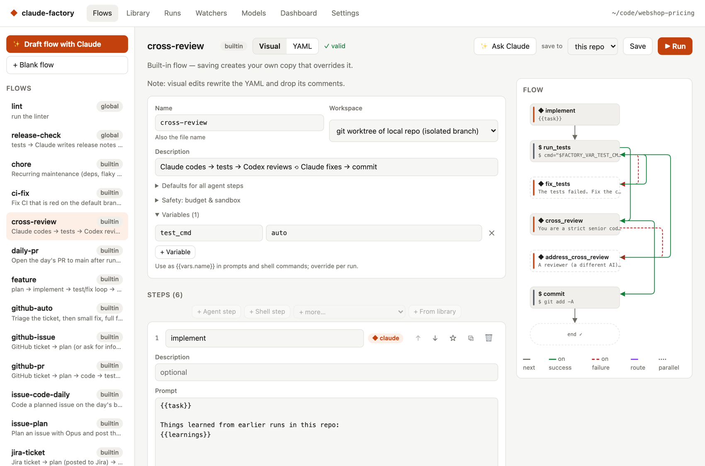

# claude-factory

An AI coding factory that runs on your own machine. You describe work as **flows** — YAML
pipelines of agent steps (Claude Code or OpenAI's Codex CLI), shell steps, approvals and
branches — and the factory runs them headlessly: from a task you type, a GitHub issue that gets
a label, a red CI build, or a schedule.



**What it does**

- **Your own flows.** Plan → code → test → review → commit → PR, or anything else. Edit them
  visually or as YAML, reuse steps from a block library, or have Claude draft a flow for you.
- **Two agents, any model.** Steps run on Claude Code or Codex (with your ChatGPT login), on
  Anthropic, OpenAI or local models (Ollama, LM Studio). Routing rules pick the model per step,
  with fallbacks when a model hits a limit.
- **Hands-off from GitHub.** Watchers turn labelled issues into plans, code and pull requests,
  answer review comments, fix a red main branch, and run recurring chores.
- **Safe by default.** Every run gets its own git worktree or clone. Pushes to protected
  branches and pushes that contain secrets are blocked. Budgets per run and per day, approval
  steps, sandboxing (Claude Code's sandbox or Docker).
- **See everything.** A web UI with live logs, readable transcripts of every agent step, diffs,
  a dashboard, resume / retry / approve buttons, and evals to compare flows and models.

## Requirements

- Node.js 20 or newer and git
- [Claude Code](https://docs.claude.com/en/docs/claude-code) (`claude`), logged in
- Optional: [GitHub CLI](https://cli.github.com) (`gh`) for GitHub flows,
  [Codex CLI](https://developers.openai.com/codex) for Codex steps, [Ollama](https://ollama.com)
  or LM Studio for local models, Docker for sandboxed test runs

## Install

```bash
git clone https://github.com/MeloMar-IT/claude-factory.git
cd claude-factory
npm install
npm run build
npm link            # or: ln -s "$PWD/dist/cli.js" ~/.local/bin/factory
```

## Quick start

```bash
cd ~/code/my-project
factory ui                      # web UI at http://localhost:4777

# or from the terminal:
factory run quick --task "Add a --json flag to the export command" --var test_cmd="npm test"
```

The run happens in a fresh worktree on a `factory/<run-id>` branch — your checkout is not
touched. Look at the result in the UI (Runs → the run → Changes) and merge the branch if you
like it.

## Documentation

The **[user guide](docs/USER_GUIDE.md)** covers everything with screenshots: writing flows,
running and resuming them, the GitHub watchers, models and routing, safety settings, costs,
evals and the CLI.

## Built-in flows

| Flow | What it does |
|---|---|
| `quick` | One agent pass, then tests with one fix attempt |
| `feature` | Plan → implement → test/fix loop → review → commit (commented format reference) |
| `cross-review` | Claude codes, Codex reviews, Claude fixes |
| `github-issue` | Issue → plan (or questions) → code → tests → review → push → report on the issue |
| `github-pr` | Like `github-issue`, then PR → wait for CI and fix it → learn |
| `github-auto` | Triage first: small fix, full feature, split into sub-issues, or ask |
| `issue-plan`, `issue-code-daily`, `daily-pr` | Label-driven pipeline with one branch per day and a daily PR |
| `pr-feedback` | Address review comments on a factory PR |
| `ci-fix` | Fix CI that is red on the default branch |
| `chore` | Scheduled maintenance; opens a PR only if something changed |
| `jira-ticket`, `linear-ticket` | Tickets from Jira or Linear, code in the local repo |

## Development

```bash
npm run build     # compile TypeScript to dist/
npm test          # vitest; uses fake claude, codex and gh CLIs — no network, no cost
npm run dev -- run quick --task "…"   # run the CLI from source
```

GitHub flows are generated from the blocks: edit `blocks/*.yaml` or `scripts/build-flows.mjs`,
then run `node scripts/build-flows.mjs`.

## License

[MIT](LICENSE)
