# Spaghetti Code Foundry user guide

Spaghetti Code Foundry runs **flows**: pipelines of steps that code, test, review and ship
changes with AI coding agents on your own machine. This guide walks through the web UI, writing
your own flows, automating work from GitHub, choosing models, and keeping it all safe.

Formerly **claude-factory**. The command is now `scf` (`factory` still works), the repository is `MeloMar-IT/spaghetti-code-foundry` and the data folder is `~/.spaghetti-code-foundry` (see [section 11](#11-upgrading-from-claude-factory)). The `<repo>/.claude-factory` folder, the labels (`claude-factory`, `factory:*`) and `factory/…` branches keep the old name.

- [1. Start](#1-start)
- [2. Run a flow](#2-run-a-flow)
- [3. Follow, approve and resume runs](#3-follow-approve-and-resume-runs)
- [4. Write your own flows](#4-write-your-own-flows) — or [let any AI write one](#let-any-ai-write-a-flow)
- [5. Models, agents and routing](#5-models-agents-and-routing)
- [6. Automate with watchers](#6-automate-with-watchers)
  - **[Label cheat sheet: which label does what](#the-label-pipeline-one-label--plan--code--one-pull-request)**
- [7. Settings and safety](#7-settings-and-safety)
- [8. Costs, dashboard and evals](#8-costs-dashboard-and-evals)
- [9. Command line](#9-command-line)
- [10. Troubleshooting](#10-troubleshooting)
- [11. Upgrading from claude-factory](#11-upgrading-from-claude-factory)

---

## 1. Start

Install it (see the [README](../README.md)), then start the UI from the repository you want
to work on:

```bash
cd ~/code/my-project
scf ui
```

The UI opens at **http://localhost:4777**. By default it only listens on your own machine; see
[Access from other computers](#access-from-other-computers). The path in the
top-right corner is the repository runs work on by default.

**First start.** The first time you open the UI there is no account yet, so it shows
**Create the admin account**: enter a name, an e-mail and a password (at least 10 characters,
twice). That signs you in. You can also create the admin in a terminal with
`scf user create --admin`; `scf ui` and `scf serve` print a hint while there is no admin. After
an upgrade from a version without sign-in, do this once; nothing else changes. The CLI, the
watchers and runs that are already going do not need an account.

**Sign in and out.** After that, the UI shows a sign-in form. Your name and a **Sign out**
button are in the top bar. You stay signed in for 7 days, or until you sign out. A password
change or a block (`scf user password`, `scf user block`) signs that account out at once. If you
are blocked, you cannot sign in. If the session ends while a page is open, the next action
brings you back to the sign-in form.

| Page | What it is for |
|---|---|
| **Your turn** | Only what waits for you, one button each; the app opens here when something waits |
| **Board** | Where every story is, in columns per repository |
| **Flows** | Your flows and the built-in ones: edit, create, run |
| **Library** | Reusable blocks of steps to drop into flows |
| **Runs** | Everything that ran or is running; the ones that need you on top |
| **Watchers** | Automatic runs from GitHub issues, PR comments, red CI, or a schedule |
| **Models** | Which agents and models are available, and which model runs which step |
| **Dashboard** | Spend, success rate, where runs fail, eval results |
| **Settings** | Budget, safety, notifications, bot identity, disk clean-up |

An account with the role `user` sees only **Runs**.

Everything the UI does is also available from the command line (see [section 9](#9-command-line)).

---

## 2. Run a flow

Pick a flow on the left, press **▶ Run**, describe the task and start it.

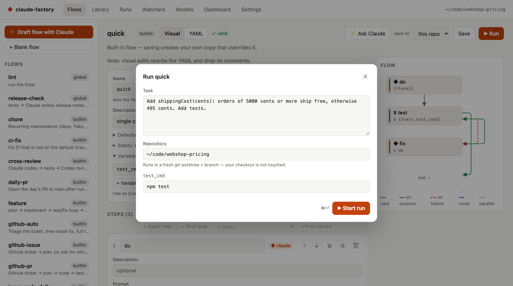

- **Task** — what you want done, in plain language. Flows use it in their prompts.
- **Repository** — the local git repository to work on.
- **Variables** — settings the flow exposes, e.g. `test_cmd`. Leave `auto` to let the Foundry
  detect the test command (npm/pnpm/yarn, pytest, Go, Cargo, Gradle, Maven, Make).

**Your checkout is never touched.** Depending on the flow's *workspace* setting, a run works in:

| Workspace | Where the run works |
|---|---|
| `worktree` (default) | A new git worktree on a `factory/<run-id>` branch of your repository |
| `empty` | An empty folder; the flow clones what it needs (used by the GitHub flows) |
| `inplace` | Directly in the repository — only for flows you trust |

When a run finishes, its branch stays in your repository. Review it, merge it, or delete it.

---

## 3. Follow, approve and resume runs

### Your turn

**Your turn** lists only what waits for you, one button each: questions to answer, approvals, failed or stopped work, a release pull request to merge, and a watcher that has an error. It never lists work that is running, queued, paused by a limit or waiting for another story, and never evaluation runs.

- **Order:** the item that holds back the most stories comes first, then the one that waits longest. Items are grouped by repository.
- **Each item:** what it is, why it waits, the action, and since when. The button opens the place to do it (GitHub in a new tab, or the run page).
- **Runs you started yourself** (UI or `scf run`) count when they wait for approval, at any age, or when they failed or stopped in the last 7 days. Failed release, CI-fix and review runs started by a watcher show the same way. Runs of older versions have no record of who started them and are treated like watcher runs.
- **Dismiss** hides an item. It stays hidden until its situation changes (a new question, a new approval, a new failure). **Show again** at the bottom brings all dismissed items back. Watcher errors cannot be dismissed. Dismissals are kept in `your-turn.json` in the data folder.
- **No refresh needed:** the page updates every 5 seconds. When you come back from a GitHub link, the watcher checks GitHub at once. An answer you give elsewhere shows at the next watcher check.
- **Empty:** it says "Nothing needs you." and, when it can, how many stories are being built and when the next release pull request is expected.
- **Badge:** the number of items shows in the navigation and in the tab title, for example "(3) Foundry". When something waits, the app opens on this page.
- **Notifications:** new items can also reach you as a macOS or Slack message; see **Notifications** under Settings.

### Since you last looked

When you open the app after a break of 30 minutes or more, a strip under the header sums up what changed since your last visit. Each line has links.

- **Stories done:** the run succeeded and committed the story.
- **Merged into develop:** the run pushed the story to `develop`. This counts even if a later step failed. A story shows under one of these two lines, from its newest run.
- **Releases to main:** a release pull request or the rolling Foundry pull request was merged. Other pull requests do not count.
- **Failed:** runs that failed. A run that a newer run of the same issue replaced, or that was interrupted, is left out.
- **Newly waiting for you:** items that started to wait for you since your last visit. The line links to **Your turn**.
- **Only the newest five** of each line are listed, followed by "+N more".
- **Per browser:** the time of your last visit is kept in this browser and shared by its tabs. **Dismiss** hides the strip in all tabs. Nothing shows when nothing changed.
- **Notes:** if GitHub could not be read, or a limit was reached (20 repositories, 200 merged pull requests, 2000 finished runs), the strip says so. If that leaves it empty, it stays hidden and tries again after 5 minutes.
- Flows that have no step named `commit` or `push_develop` never show stories as done or merged.

### The health line

A line under the top bar of every page says **All good**, or the number of problems of the Foundry itself and one line for each: who has the next move, what to do, why, "Continues: …" when it continues by itself, and a link to the place to act. The sentences come from the server, so they read the same as on the other pages. It asks again on every page change and every 30 seconds. When the server does not answer, the line says so.

- **A restart is waiting:** "A new version is waiting — it restarts after 2 runs." The number is the runs that are active or queued.
- **A usage limit:** one line per agent (Claude, Codex), not per run, with the time it continues. It shows for an hour after the run stopped; a watcher tries again every 30 minutes, so a limit that lasts keeps showing. A used-up daily budget is a problem too; the link goes to Settings.
- **A watcher error:** it names the repository, for example "The watcher for acme/app can't reach GitHub", with the action to check the network and `gh auth status`. Equal sentences for one repository show once. A watcher that has not checked for 3× its interval shows too, except while the server waits to restart (the watchers are stopped on purpose then).
- **An issue closed on GitHub while its run still works:** with a **Cancel run** button. It asks you to confirm, cancels that run and reloads the line. You can resume the run later.
- **A run that failed because of the Foundry:** the newest run per issue that no newer run replaced, from the last 7 days, at most 5. The line says "The Foundry failed, not the code" with the fix and a link to the run; the reason is on the run page.
- **Last check per repository:** each repository of an enabled watcher is listed with the time of its last successful check (the oldest, when it has several watchers), or "no successful check yet".

The same data is at `GET /api/health`: `ok`, `summary` ("All good", "1 problem", "N problems"), `problems` (records like those of `GET /api/next`) and `repos`. It holds no settings, tokens or paths, and links are only `https://…` or `#/…`.

### The board

**Board** shows where every story is, like a parcel tracker. There is one board per repository; with more than one repository you get tabs.

- **Columns:** *Your turn* (something waits for you; here it also holds a run you stopped yourself, which the Your turn page does not list), *Waiting for another story*, *Queued* (also paused by a limit), *Planning*, *Coding*, *Reviewing*, *Merging* (also finished work that waits for the scheduled release), *Done* (grouped Today and This week) and *Failed*.
- **Which stories show:** every issue a watcher tracks, at any age. Other runs on an issue show for 7 days after they end. Done shows the last 7 days. Evaluation runs and runs without an issue never show.
- **The card:** issue number and title, what happens next, the current step ("coding — step 12 of 29"), and the stories it waits for ("after #88"). Click the card to open its run page. A story that has no run yet is not a link; use the issue link on it.
- **Highlight:** "What is in the way of #89?" marks the whole chain of stories that hold it back and dims the others. The line above the board lists the chain, also stories that have no card. **Show all** clears it.
- **Updates:** the page asks every 5 seconds, so what the Foundry knows shows within 5 seconds. Changes on GitHub show after the watcher's next check; when you come back from a GitHub link, the watcher checks at once.
- **Which column running work is in:** the Foundry reads it from the step names. Steps like `plan`, `ask_for_info` and `risk_gate` are Planning; `implement` starts Coding; `review`, `review_1` and `review_2` start Reviewing; `commit`, `push…` and `open_pr` start Merging. Any other step name stays in the phase of the step before. A flow with other names shows its running work under Coding.

### The runs list

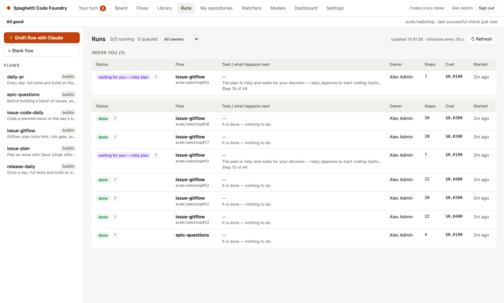

Runs whose next move is yours (the record says **You**) are listed under **Needs you**. Runs
that wait for a limit, the budget or another run are not. Under each task the table shows the
"what happens next" sentence, also for finished runs. At most *N* runs execute at the same time
(Settings → Runs at the same time); the rest queue. Each queue line shows the same sentence
and a link to what it waits for.

An admin sees every run, with an **Owner** column, and can pick one account in the **Owner**
filter next to the title (the list shows "All owners" and each account with its number of runs).
A user sees only their own runs and their own queued runs; runs of others in front of them show
as "n runs ahead of you".

The Status column shows the plain status name (see "Words the Foundry uses"). Press the **?**
next to it to read what it means and what happens next, and press it again to close it. It
works with a mouse, the keyboard (Tab, then Enter or Space) and touch. Pressing it does not
open the run.

**How long will it take?** A run that is not finished shows "Step N of M": the number of its
step in the flow. It can jump, because steps that only run when another step jumps to them are
counted too. A running run also shows an estimate ("Estimate: about 20 min left (usually 25–40
min in total)"). It comes from succeeded runs of the same flow (same steps) in the same
repository, among the newest 500 runs, and counts working time only. It appears after 3 such
runs and starts again when steps are added, removed or renamed. It is an estimate, not a
promise. "Taking longer than usual" means a step runs much longer than it usually does. Nothing
is wrong yet: look at the live log.

### A run

Open a run to follow it live. At the top, the **What happens next** block says who has the next
move, what to do, why, a link to the place to do it, and when it continues by itself (if
known). It updates live. While the run is not finished it also shows its progress, the estimate
and the "Taking longer than usual" hint (see "How long will it take?" above). For a failure it
says what happened, why and what you can do in plain words. The raw reason (for a waiting run, the approval message) is the **Details** row below.

The status next to the flow name has the same **?**. The **Current step** (while the run
works) or **Resumes at step** (when it is stopped) row names the step and says what it does:
its description, or the kind of step when the flow gives none.

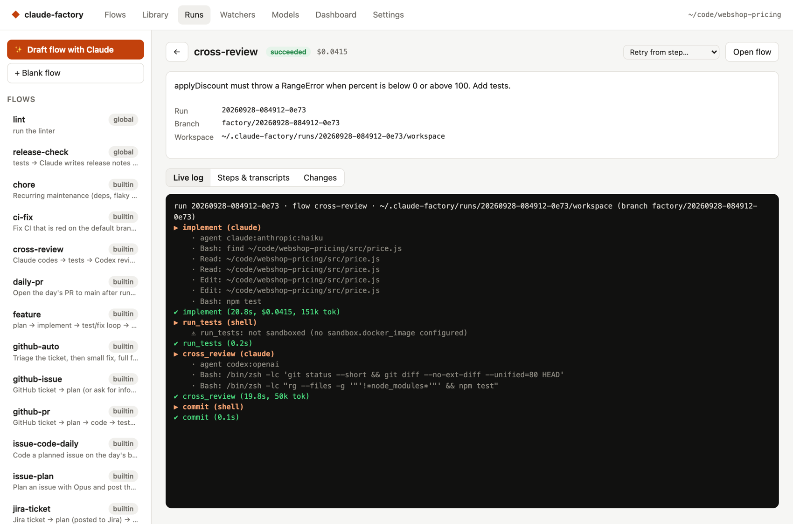

- **Live log** — each step as it starts and ends, with the agent's tool calls, duration, cost or
  tokens. A user sees the steps and the tool names only.
- **Steps & transcripts** — every step with its outcome. Open an agent step to read the whole
  conversation: what it said, each command it ran and the output, and the final result. The
  label next to the step name shows which agent and model ran it (here Claude on Haiku wrote the
  code, and Codex reviewed it).

  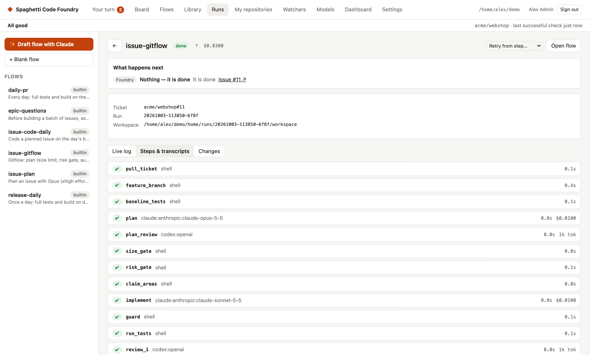

  A user sees **Steps** only: each step with its result and a plain sentence for a failure, but
  no output, no transcripts and no cost.

- **Changes** — the complete diff the run made, including uncommitted work.

  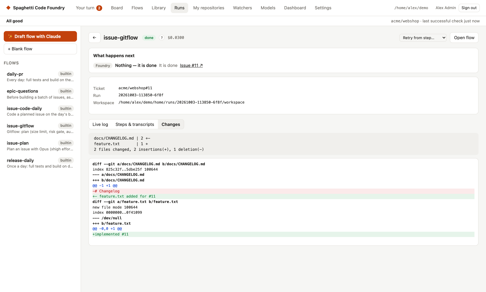

### Approvals

An **approval** step pauses the run until a person decides. Approve or reject in the UI, with
`scf approve <run-id>` / `scf reject <run-id>`, or — for GitHub flows — by commenting
`/approve` or `/reject` on the issue (only people with write access count). A waiting run shows
a **What happens next** block with **You** as who and the approval message as the reason.

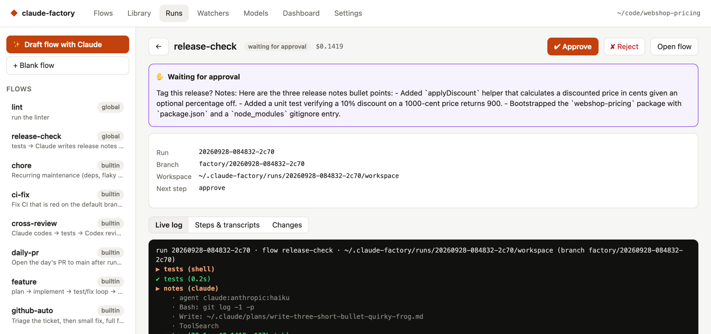

### When something goes wrong

- **Resume** continues a stopped, failed, cancelled or interrupted run from the step where it
  stopped, with everything it already did kept. Fix the cause first (e.g. answer the question,
  fix the environment), then press **↻ Resume**.
- **Retry from step…** re-runs from any earlier step.
- **Cancel** stops a running run, or a run that waits for approval; you can resume it later.
  Removing a queued approval from the queue cancels that run too (Resume brings the approval back).

Runs survive restarts: if the Foundry stops mid-run, the run is marked *interrupted* and can be
resumed (watchers do this automatically).

**When the Foundry itself failed.** Some failures are not a bug in the code. The run page, the
Runs list, the watcher card, the Dashboard and the notification then say "The Foundry failed, not
the code", what went wrong and the fix. The causes and fixes:

- A command the agent was not allowed to run: allow it in the flow (the step's allowed tools or
  permission mode), then resume. The sentence shows only the tool and program, e.g. `Bash: curl`;
  the run page's log has the whole command.
- A push to a protected branch was blocked: change **Protected branches** in Settings or the
  flow's branch, then resume.
- A marker the Foundry could not read (no `PLAN_STATUS` line, no questions to ask, no `SUBTASK`
  lines): resume the run to try the step again.
- An internal error, an unknown step, or a run that failed before any step ran (workspace, bot
  identity, GitHub App token): fix the setting, or restart or update the Foundry, then resume.
- An interrupted run: resume it (a watcher does this by itself).

A failed test, guard or review, too many visits of a step and a push blocked by the secret scan
are code failures and keep the usual text. If a command was blocked earlier in such a run, the
sentence adds a hint to allow it in the flow if it was needed.

### Words the Foundry uses

One glossary decides the words. The app, the comments on GitHub and the labels all use them.
Every status in the app has a **?** that shows the two sentences from this table.

| Status | What it means and what happens next |
|---|---|
| waiting for you — questions | The Foundry has questions about this issue before it starts. Answer them on the issue, or reply /defaults to go with the recommendations. When the planner asks: The planner has questions that the issue and the code do not answer. Answer them and the work goes on. |
| waiting for you — risky plan | The plan is risky, or you asked to check it, so coding waits for your decision. Approve it to start coding, or reject it and say what to change. |
| waiting for you — split | The issue is too big for one change, so the Foundry proposes smaller issues. Approve and it creates them and closes this one, or reject it and say what to change. |
| waiting for you — approval | A step of the run asks for your approval before it goes on. Approve or reject it, and the run goes on with your decision. |
| waiting for you — stopped | The run stopped at a step that needs a person. Look at the run, fix what it asks for and resume it. |
| waiting for you — release pull request | A release pull request brings finished work to main, and this one is not merged yet. Merge it and the Foundry goes on. |
| in develop (ships with the 17:00 release) | The work is finished and waits for the 17:00 release. Nothing to do now — the release pull request then brings it to main. |
| waiting for #88 | It needs #88 to be done first. Nothing to do — it starts by itself after that. |
| waiting for another run | Only one run at a time works here, and another run is active. Nothing to do — it starts when that run is finished. |
| waiting for another run in the same code | Another run is changing the same part of the code. Nothing to do — it goes on when that run is finished. |
| paused — usage limit | The usage limit of the AI account is reached. Nothing to do — the Foundry tries again after the limit resets. |
| paused — daily budget | Today's budget is used up. Nothing to do — it goes on tomorrow. |
| checking for questions | The Foundry reads the new issues and looks for questions only you can answer. Nothing to do — an issue without questions starts after the check. |
| starting soon | Nothing is in the way, it only waits for the watcher's next check. Nothing to do — it starts by itself. |
| queued | It waits in the queue until a run finishes. Nothing to do — it starts by itself. |
| working | The Foundry is working on it right now. Nothing to do — you can follow it on the run page. |
| interrupted | The run was cut off, for example by a restart of the server. A watched issue resumes by itself at the next check, any other run you resume on its page. |
| cancelled | Someone cancelled the run. A watched issue resumes by itself at the next check, any other run you resume on its page if you still want it. |
| failed | A step failed and the run could not go on. Fix the cause if needed, then start over or resume the run at the failed step. When the Foundry itself failed: The Foundry itself failed, not the code: a blocked command, a marker it could not read or a broken setting. Follow the suggested fix, then start over or resume the run. |
| watcher error | The watcher could not do its check, so its issues do not move. Look at the error on the Watchers page and fix the cause, it then tries again at the next check. |
| watcher silent | The watcher has not finished a check for a long time, so its issues do not move. Press Check now on the Watchers page. |
| closed on GitHub, run still busy | The issue was closed on GitHub, but its run is still working or waits for approval and nothing was changed. Cancel the run on its page if the work is no longer wanted. |
| restarting soon | The server waits to restart and starts nothing new until then. Nothing to do — it restarts when the active runs are done. |
| replaced by a newer run | A newer run took over the same work. Nothing to do with this run. |
| done | The work is finished. Nothing to do. |

Other words:

- **release pull request** — the pull request that brings finished work to `main`.
- **split risk** — how risky it is to create the smaller issues without you looking, 0–100.

A watcher's own state on the Watchers page has a **?** too:

- **active** — The watcher checks GitHub on its schedule and starts runs. Nothing to do — it works by itself.
- **disabled** — The watcher is switched off, so it checks nothing and starts nothing. Enable it on the Watchers page when you want it to work again.
- An error shows as **watcher error** (see the table).

Every record from `GET /api/next` has these as `status` and `help`. Text the Foundry quotes
(an error message, a step's approval message, a label or code-area name) is shown as it is.

---

## 4. Write your own flows

### The editor


Edit a flow **visually** (left) or as **YAML** (tab at the top). The graph on the right shows
how steps connect: grey = next, green = on success, red dashed = on failure, purple = route.

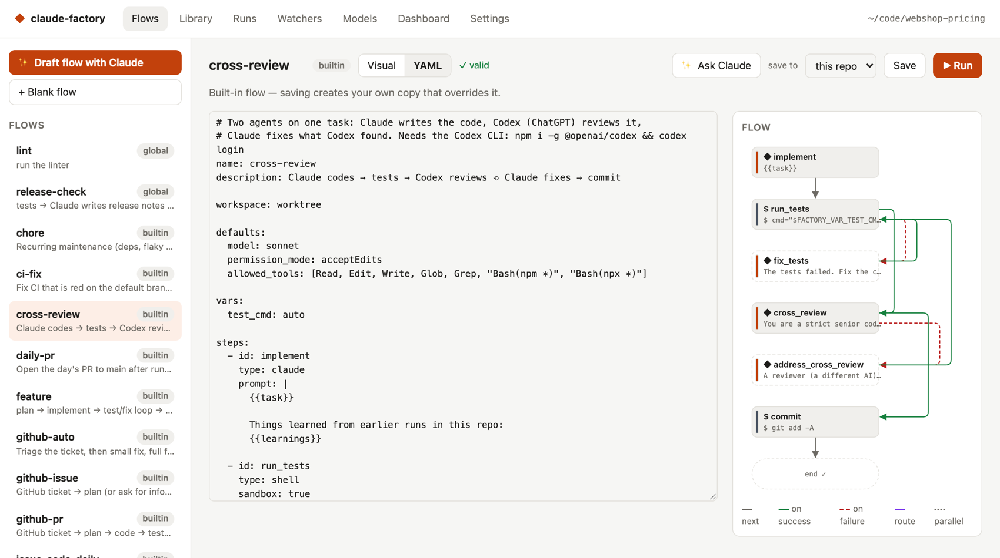

- **Save to** — *this repo* (`<repo>/.claude-factory/flows/`, shared with your team through git)
  or *global* (`~/.spaghetti-code-foundry/flows/`, just for you). Saving a built-in flow creates your own
  copy that overrides it.
- **✨ Draft flow with Claude** — describe what you want and Claude writes the YAML.
  **Ask Claude** changes the open flow the same way.
- **+ From library** inserts a block from the [Library](#the-block-library).
- **Publish to users** — choose whether users may start this flow ("Available to users"), the
  name and description they see, and for each variable whether it is *hidden* (your value is
  used), *fixed* (shown, cannot be changed) or *user fills in* (with a label, help text,
  "Required" and a default). Tick **Own default** to give the input its own default, even an
  empty one; unticked, it uses the flow's value. The version goes up by itself when you save a
  change. A published flow cannot have sub-flow steps, and a shell step must read an input as
  `$FACTORY_VAR_NAME`, not `{{vars.name}}`. An approval message is shown to users, so it may only
  use `{{task}}`, `{{vars.<name>}}` of a variable users see (fixed or input, or `github_repo` or
  `issue`) and `{{steps.<id>.output}}`; the flow is refused on save otherwise.

### Let any AI write a flow

[`docs/FLOW_AUTHORING.md`](FLOW_AUTHORING.md) is a complete, self-contained description of the
flow format written for AI assistants: every field, step type, template and environment
variable, the common patterns (test/fix loops, review gates, asking a human, pull requests), a
checklist and a full example. Give it to any assistant — ChatGPT, Claude, Gemini, Codex or a
local model — and describe the flow you want:

```bash
scf flow-guide > flow-guide.md        # or copy docs/FLOW_AUTHORING.md
```

1. Paste (or attach) the guide in a new chat, then write what the flow should do, e.g. *"Opus
   plans a database migration, I approve the plan, Sonnet implements it with pytest tests, up to
   3 fix rounds, Codex reviews once, then push the branch and open a PR."*
2. Save the YAML it answers with as `<repo>/.claude-factory/flows/<name>.yaml` (or in
   `~/.spaghetti-code-foundry/flows/`).
3. Check it: `scf validate <name>` — it names the field and step for anything that is wrong;
   paste that back to the assistant to fix it. Then open it in the editor to see the graph.

**✨ Draft flow with Claude** in the editor uses the same guide, so both ways produce the same
kind of flow. The examples in the guide are checked by the test suite, so they always match the
current format.

### Step types

| Type | What it does |
|---|---|
| **Agent** (`type: claude`) | Runs Claude Code or Codex with a prompt |
| **Shell** | Runs a command; exit code 0 = success |
| **Approval** | Pauses until a person approves (→ on success) or rejects (→ on failure) |
| **Parallel** | Runs several agent/shell steps at once; succeeds when all succeed |
| **Sub-flow** | Runs another flow inline, in the same workspace |

### Controlling the path

Steps run top to bottom. Each step can change that:

- **On success / On failure** — `next` (default on success), `fail` (default on failure), `end`
  (finish as succeeded), `stop` (pause for a human), or a step id to jump to.
- **Routes** — on success, jump to a step when the output matches a pattern, e.g.
  `^ROUTE: small` → `quick_fix`. The first match wins.
- **Pass if / Fail if** — patterns that decide success from the output, e.g. an agent that must
  end with `VERDICT: APPROVE`.
- **Only reachable via jumps** — the step is skipped in the normal order (for fix-up handlers).
- **Max visits** — how often a step may run in one run (default 5); guards loops like
  test → fix → test.
- **When resumed, restart at** — for a step that stops the run, where a resume should continue.

A typical fix loop:

```yaml
steps:
  - id: implement
    type: claude
    prompt: "{{task}}"

  - id: run_tests
    type: shell
    run: npm test
    on_failure: fix_tests

  - id: fix_tests
    type: claude
    jump_only: true
    max_visits: 3
    prompt: |
      The tests fail. Fix the code.
      {{steps.run_tests.output}}
    on_success: run_tests
```

### Passing information between steps

In **agent prompts** you can use:

| Template | Value |
|---|---|
| `{{task}}` | The run's task |
| `{{vars.name}}` | A flow variable |
| `{{steps.<id>.output}}` | Output of an earlier step (also `.ok`, `.exit_code`) |
| `{{learnings}}` | Lessons saved by earlier runs in this repo |
| `{{run.history}}` | Which steps ran so far and how they ended |
| `{{workdir}}`, `{{run.id}}`, `{{run.branch}}` | Where and what this run is |

**Shell commands** may only template trusted values (`{{vars.*}}`, `{{workdir}}`, `{{run.*}}`).
Task text and step outputs could contain anything, so shell steps read them from environment
variables instead: `$FACTORY_TASK`, `$FACTORY_OUT_<STEP_ID>`, `$FACTORY_VAR_<NAME>`,
`$FACTORY_RUN_ID`, `$FACTORY_BRANCH`, `$FACTORY_NEXT_<REASON>`, `$FACTORY_FIRST_<REASON>`, `$FACTORY_FIRST_NOTHING`, `$FACTORY_FIRST_INFO` and the other report lines (also as `$SCF_…`).

An agent step can **continue the session** of an earlier agent step ("Continue session of"), so
it remembers the conversation.

### Variables

Flow variables (`vars:`) have defaults in the flow and can be overridden per run, per watcher,
or per repository in `<repo>/.claude-factory/config.yaml`:

```yaml
vars:
  test_cmd: ./gradlew test
```

The editor keeps empty values (`issue: ""`), so a variable you have just added stays.

### The block library

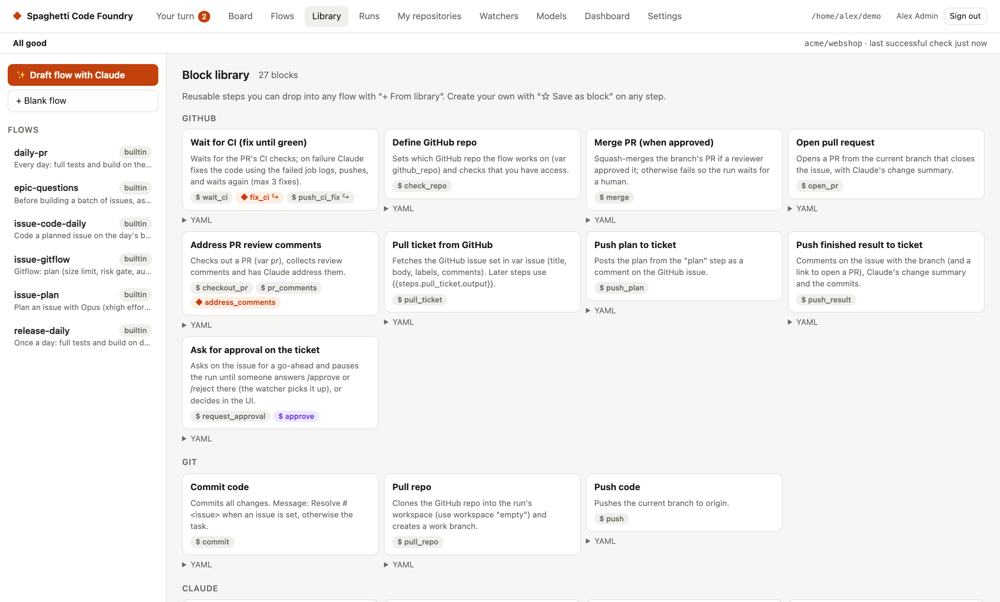

Blocks are ready-made groups of steps: pull a GitHub issue, plan, code, run tests with a fix
loop, code review, cross-review by Codex, commit, push, open a PR, wait for CI, secret scan,
Jira and Linear, and more. Insert one with **+ From library** in the editor. Turn any step into
your own block with **☆ Save as block**.

---

## 5. Models, agents and routing

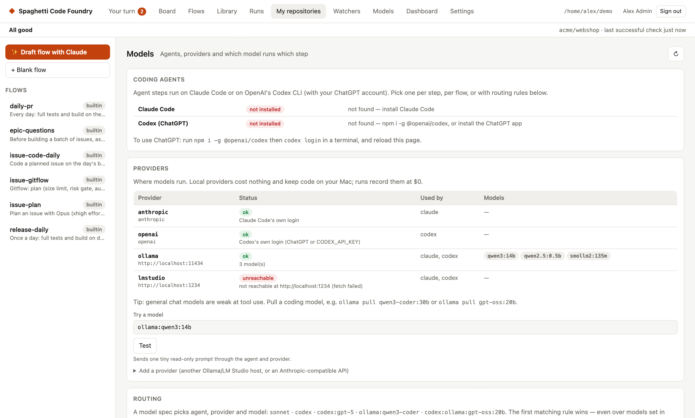

### Agents

Agent steps run on one of two command-line agents:

- **Claude Code** — uses your Claude login (or an API key).
- **Codex** — OpenAI's Codex CLI with your ChatGPT login. Install it with
  `npm i -g @openai/codex` (or use the one inside the ChatGPT desktop app) and run `codex login`.

The **Coding agents** panel shows whether each is installed and logged in.

### Model specs

Wherever you can pick a model — a step, a flow's defaults, a routing rule, an eval — you write a
*model spec*:

| Spec | Runs on |
|---|---|
| `sonnet`, `opus`, `haiku` | Claude Code, Anthropic |
| `codex` | Codex, its default OpenAI model |
| `codex:gpt-5` | Codex with a specific model |
| `ollama:qwen3-coder:30b` | Claude Code on a local Ollama model |
| `codex:ollama:gpt-oss:20b` | Codex on a local Ollama model |
| `lmstudio:<model>` | Claude Code on LM Studio |

You can also set **Agent** and **Provider** separately on a step.

### Providers and local models

Anthropic, OpenAI, Ollama (`localhost:11434`) and LM Studio (`localhost:1234`) are built in.
Add your own (another Ollama host, or any Anthropic-compatible API) under **Add a provider**.
Local models cost nothing and keep your code on your machine; runs record them at $0. Choose
models trained for coding and tool use (e.g. `qwen3-coder`, `gpt-oss`) — general chat models
often fail to call tools. Use **Try a model** to check one works before you rely on it.

### Routing

**Rules** decide which model runs which step. The first matching rule wins — even over models
written in flows and blocks. A rule matches on a step id pattern, a flow name pattern and/or a
visit number (`From visit 2` = only retries). The presets add common rules:

- **Retries on Opus** — fix steps use Opus from their second attempt.
- **Codex reviews Claude's code** — review steps run on Codex.
- **Small jobs on a local model** — triage and learning steps run locally.

Without a matching rule, a step uses its own model, then the flow's default, then the
**Default model**.

**Fallback models** are tried in order when a model hits a rate or usage limit. With *continue
on the first free one when a budget runs out*, runs switch to the first free fallback (local or
ChatGPT) instead of pausing when the daily or run budget is used up.

---

## 6. Automate with watchers

A watcher checks GitHub on a schedule and starts runs by itself — as long as the Foundry is
running (see [Keep it running](#keep-it-running)). GitHub access uses the `gh` CLI's login.

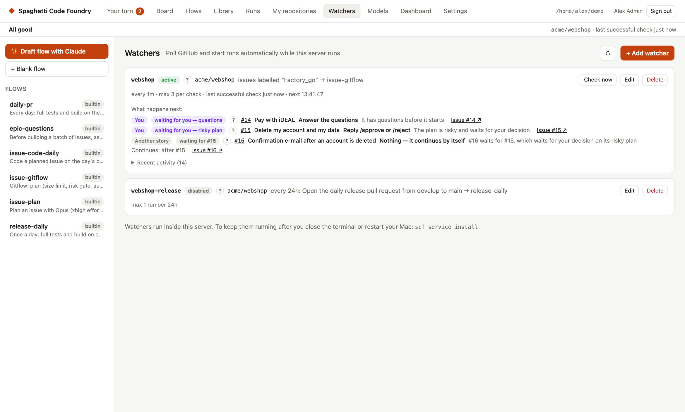

### Sources

| Source | Starts a run when… | Default flow |
|---|---|---|
| **Issues** | an open issue has the trigger label | `issue-gitflow` (or `issue-plan` / `issue-code-daily` for the human-in-the-loop pipeline) |
| **Schedule** | it is time (every N, or once a day at a set time) | `release-daily` |
| *Review comments* | someone comments on a Foundry PR (branch `factory/*`) | none shipped — name your own flow |
| *CI failures* | the latest CI run of a workflow on the default branch failed | none shipped — name your own flow |

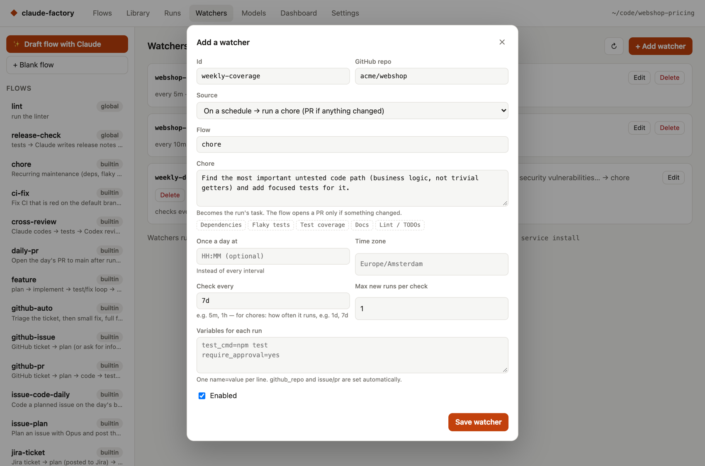

For a **schedule**, the text becomes the run's task. Intervals: `30s`, `5m`, `1h`, `7d`; or set
**Once a day at** `17:00` with a time zone.

### How issue watchers use labels

For each issue with the trigger label the watcher sets status labels, so you can follow along
in GitHub:

| Label (default name) | Meaning |
|---|---|
| `factory:working` | Working — nothing to do, it continues by itself |
| `factory:needs-info` | Waiting for you — questions: reply on the issue, or reply `/defaults` |
| `factory:waiting-approval` | Waiting for you — approval: reply `/approve` or `/reject` on the issue |
| `factory:done` | Done — nothing to do |
| `factory:failed` | Failed; the comment on the issue starts with what you need to do, then says what happened and why, with the failing output. Remove the label to start over, or resume the run on its page to continue at the failed step. If the Foundry itself failed, the comment says so and names the fix |

The descriptions on GitHub say the same in short. They are set when the labels are created and
refreshed at every server start. The trigger label and the review label (`vars.review_plan_label`)
get one too. If the review label is the same as the trigger label, the one description says both.

Each watcher's card on the **Watchers** page lists the labelled issues it is *not* working on
right now under **What happens next**, with the same lines as the Dashboard. A watcher error is
a line too; the raw error is under **Error details**.

Every check also compares the label with the newest run and fixes what is safe to fix: a run that
is working (for example approved or resumed on its page) gets `factory:working`, and a label that
does not match the run (say `factory:failed` while the run waits for approval) is corrected. A
`factory:done` label is left alone, and an issue without a status label starts over. If you close
an issue on GitHub while its run is still working or waits for approval, nothing is changed; the
watcher says so (see [Why is nothing happening?](#why-is-nothing-happening)) and you decide
whether to cancel the run. Every label change is in the card's **Recent activity**. Next to the
repository the card shows **last successful check …**, also when the newest check failed.

More options are set in `~/.spaghetti-code-foundry/config.yaml` (the form keeps them when you edit the
watcher). This is the watcher for the [one-label pipeline](#the-label-pipeline-one-label--plan--code--one-pull-request):

```yaml
watchers:
  - id: webshop
    source: issues
    flow: issue-gitflow            # feature branch per issue → merged into develop
    precheck_flow: epic-questions  # ask all open questions for new issues first
    github_repo: acme/webshop
    label: Factory_go
    exclude_labels: [wontfix]
    status_labels: {working: Factory_working, done: Factory_done, needs_info: Factory_needs_info, waiting: Factory_waiting, failed: Factory_ERROR}
    remove_on_done: [Factory_go]
    max_per_tick: 2                # issues on different code areas are coded in parallel
    dependency_done_labels: [Factory_done]
    vars:
      test_cmd: ./gradlew test
      docs_required: docs/CHANGELOG.md
      union_merge_files: docs/CHANGELOG.md   # merges keep both sides' entries
      agent_env: JAVA_HOME=/path/to/jdk      # extra environment for the coding agents
      develop_branch: develop
      risk_threshold: "75"         # plans scoring above this wait for /approve
  - id: webshop-release
    source: schedule
    flow: release-daily            # daily tests + build on develop, PR develop → main
    github_repo: acme/webshop
    at: "17:00"
    timezone: Europe/Berlin
    task: Daily release pull request develop → main
```

| Option | What it does |
|---|---|
| `exclude_labels` | Never touch issues with any of these labels |
| `status_labels` | Your own names for the status labels above |
| `remove_on_done` | Labels to remove when a run succeeds (e.g. the trigger label) |
| `one_at_a_time` | Never run two of this watcher's runs at once |
| `wait_for_dependencies` | On by default: an issue with a **Depends on** / **Blocked by** section waits until those issues are closed (or have a `dependency_done_labels` label) |
| `dependency_done_labels` | Labels that also count as "done" for dependencies, e.g. `Factory_done` |
| `precheck_flow` | Run this flow once over all new labelled issues before any is started (`epic-questions` asks every owner decision up front) |
| `pause_while_pr_open` | Start nothing while a PR from a branch with this prefix is open (for the older two-label pipeline) |
| `comment_on_failure` | On by default: post the failure reason and output on the issue |
| `owner` | The e-mail of the account that owns this watcher's runs and may read and approve them. Empty: the first admin. Only an admin can set it, and it must be an account |

**Coding agents run the build themselves.** In the issue flows the coding agent may run the
project's build and test commands (`./gradlew`, `mvn`, `npm`, `pytest`, `go test`, `cargo`,
`make`) and read-only git commands — so it can check its own work and, for example, regenerate
test fixtures. Pushing is never allowed. If the build needs environment settings (such as
`JAVA_HOME`), put them in the `agent_env` variable: `KEY=value` pairs separated by `;` or new
lines. `PATH`, tokens and the Foundry's own variables can't be set this way.

### The label pipeline: one label → plan + code → one pull request

The built-in flows `epic-questions`, `issue-gitflow` and `release-daily` form a pipeline that you
drive with **one label**. You only step in for three things: answering questions (asked all at
once, up front), approving **risky** plans, and merging the pull request. (Label names below are
the ones from the example configuration; yours are whatever you set in the watcher.)

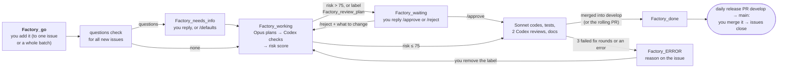

#### The only label you set

| Label | Add it when… | What happens |
|---|---|---|
| **`Factory_go`** | the issue (or a batch of issues) should be built | New issues are first checked together for questions only you can answer. Then each issue is planned **right before it is coded**, in one run: Opus plans, Codex checks the plan against the code, both give a **risk score**, the plan is posted on the issue — and coding starts straight away unless the plan is risky. |
| `Factory_review_plan` *(optional)* | you always want to approve this issue's plan yourself | The plan waits for your `/approve`, whatever its risk score |

#### The risk score

Every plan gets a score from 0 to 100 from Opus, and Codex gives its own; the higher one counts.

| Score | Typical change |
|---|---|
| 0–25 | local, well covered by tests, easy to undo |
| 26–50 | several modules, or behaviour users see |
| 51–75 | persistence or migrations, concurrency, public APIs or file formats, hard to test |
| **76–100** | security or trust (signing, secrets, auth), installing/updating/deleting software or user data, irreversible steps, privacy — or assumptions the planner couldn't verify |

**Above 75 a human decides:** the plan is posted with the score and the reason, and the run waits
(label `Factory_waiting`). The comment starts with `**What you need to do:** Reply /approve or /reject.` and ends with: "The plan is risky and waits for your decision —
reply /approve to start coding (optionally with notes), or /reject followed by what to change — it
then plans again." Your feedback goes into the new plan. Only people with write access to the
repository can approve. (The threshold is the `risk_threshold`
variable, default 75.)

#### Issues that are too big

When the planner finds an issue too big for one change, it proposes a **split** into smaller
issues that can each be built and tested on their own, and scores how risky it is to split
without you looking (0–100: a mechanical split along existing boundaries is low; deferring or
reinterpreting scope, or anything that needs your decision, is high).

- **Split risk 50 or lower:** the Foundry creates the new issues by itself — with the original's
  labels, `Factory_go`, and a **Depends on** section with the real issue numbers so they are built
  in order — comments the list on the original and closes it. The new issues then go through the
  questions check and are built like any other.
- **Above 50**, or the issue has `Factory_review_plan`: the split is posted on the issue and waits
  (`Factory_waiting`). The comment starts with `**What you need to do:** Reply /approve or /reject.` and ends with: "The issue is split into smaller ones and waits for
  your decision — reply /approve and the Foundry creates these issues and closes this one, or
  /reject followed by what to change."
- **You already agreed** to a split in a comment ("split it"): it creates the issues without asking.

The threshold is the `auto_split_max_risk` variable (default 50).

#### Labels the Foundry sets

| Label | Means | What you do |
|---|---|---|
| `Factory_needs_info` | Waiting for you — questions: asked up front for the whole batch, or by the planner | Reply on the issue — or just **`/defaults`** to accept the recommendations. It continues by itself. |
| `Factory_working` | Working, or paused — usage limit: planning and coding are running or paused | Wait; follow it on the Runs page |
| `Factory_waiting` | Waiting for you — risky plan / split: it waits for your decision | `/approve` or `/reject` + feedback on the issue |
| `Factory_done` | Done: implemented, tested, reviewed and merged into `develop` (gitflow) or in the rolling pull request | Nothing — merge the release pull request (or the rolling one) when you like |
| `Factory_ERROR` | It failed; the comment on the issue starts with what you need to do, then says what happened and why, with the failing output | Fix the cause if needed, then remove the label to start over, or resume the run on its page to continue at the failed step. If the Foundry itself failed, the comment says so and names the fix |

Issues with an excluded label (e.g. `geni`) are never picked up, whatever other labels they have.

#### How do I…?

| I want to… | Do this |
|---|---|
| Build an issue, or a whole epic | Add `Factory_go` to each issue (select them all in GitHub's issue list → Labels). Give stories a **Depends on** section so they are built in order. |
| Answer the questions | Reply on the issue, or `/defaults` |
| Check a plan before it is coded | Add `Factory_review_plan` before (or together with) `Factory_go` |
| Approve / reject a risky plan | `/approve` (+ notes), or `/reject` + what to change |
| Retry after an error | Remove `Factory_ERROR` to start over, or resume the run on its page to continue at the failed step |
| Stop the Foundry from touching an issue | Remove `Factory_go`, or add an excluded label |
| Get the work into `main` | Merge the release pull request `develop` → `main` (gitflow), or the rolling Foundry pull request |

#### Why is nothing happening?

Look at the **Dashboard**: the **Waiting** card lists every labelled issue that isn't being
worked on right now (the same list is on each watcher's card on the **Watchers** page). Every
line starts with a badge for who has the next move (**You**, **Foundry**, **Another story**, **A
time limit**, **Something is wrong**), then the status name with its **?** (press it for what
it means and what happens next), then the issue, what to do, why, "Continues: …" when it
continues by itself (it can say how long the run it waits for still needs, for example "after #88
(about 20 min left)", and the Runs list shows it too), and a link to the place to do it (GitHub links open in a new tab). Lines
where you have the next move come first, above the rest. The state of the watcher itself
(**active**, **disabled** or **watcher error**) has a **?** too. Problems of the Foundry itself
(a restart wait, a usage limit, a watcher error) are in the [health line](#the-health-line) on
every page. Runs that started and then paused are listed too: a usage
limit, the daily budget, a code area that another run uses, or an interruption. The same
sentences are in the failure comment on the issue and in notifications, and they also end the
Foundry's comments that ask you something (questions, a risky plan, a split, the push approval).
The comment has the fixed sentence; the Dashboard may add the number of questions or what is being
approved. Every comment that needs you starts with one bold line, `**What you need to do:** …`, so you
see at once what to do. For a risky plan it looks like this:

```
**What you need to do:** Reply /approve or /reject.

🤖 **Spaghetti Code Foundry plan**
…
_The plan is risky and waits for your decision — …_
```

A comment that only reports something says so too. In flows built from the `push-plan`,
`push-result` and `triage` blocks the plan comment starts with `**Nothing needed from you**`. The result comment starts
with `**What you need to do:** Review and merge the pull request.` when there is a pull request, else
with `**What you need to do:** Open a pull request from the branch.` The comment that lists the new
issues after a split starts with `**Nothing needed from you**`. In `github-auto` it starts with
`**What you need to do:** Start the new issues when you want them built.` when the new issues are not
picked up by themselves (`auto_subtasks` is `no`).

The label-driven flows do the same:

- The plan from `issue-plan` starts with
`**What you need to do:** Add the code label to start coding.`
- The result of `issue-code-daily`, `issue-deliver` and `issue-gitflow` starts with
`**Nothing needed from you** — it goes to main with the release pull request.`
- The reply of `pr-feedback` after review comments starts with
`**What you need to do:** Look at the changes.`
- The daily report (`daily-pr`) and the release check (`release-daily`) start with
`**What you need to do:** Merge the release pull request when you like.` when the checks pass, and with
`**Nothing needed from you** — it stays a draft until the checks pass.` when they fail.

The empty line and the heading follow, as before.

In `issue-gitflow`, a plan that starts coding by itself starts with
`**Nothing needed from you** — it is being worked on.` The server gives
them for every run and issue at `GET /api/next` (and as `next` on each run). The usual reasons:

- **It needs you:** a question (`Factory_needs_info`), a risky plan (`Factory_waiting`) or an
  error (`Factory_ERROR`).
- **It waits for another issue.** If the issue has a **Depends on** (or **Blocked by**) line or
  section, it starts only when those issues are done — closed, or `Factory_done` (in the Foundry
  pull request). You can name them as `#72` or by title (`Story 4 — Download the update safely`).
  So you can put `Factory_go` on a whole chain at once; each story is planned and coded on top of
  the code of the one before it.
- **Another issue is being built.** One issue at a time per repository; the rest start after it.
- **New issues are being checked for questions** (a few minutes, once per batch).
- **The usage limit or the daily budget is reached.** Runs pause and continue by themselves
  later; the label stays `Factory_working`.
- **The Foundry isn't running.** Watchers only run while `scf ui` / `scf serve` runs.
- **It has an excluded label** such as `geni`.
- **The issue was closed on GitHub, but its run is still working or waits for approval.** The
  line says so and links to the run page. Cancel the run there if the work is no longer wanted;
  if the issue was closed by the run itself (report, split, merge) you see nothing.
- **The watcher has not checked for a long time** (more than three times its interval). The line
  says since when ("has not checked since 11:20"). Press **Check now** on the Watchers page; the
  line is gone after the next check.

#### Branches: gitflow (recommended) or one rolling pull request

The pipeline can deliver in two ways; the watcher's flow decides which.

**Gitflow — flow `issue-gitflow`, with `release-daily` once a day**


- Every issue gets its own branch, `feature/<issue>-<title>`, from `develop`. When its tests and
  both Codex reviews pass, the **Foundry merges it into `develop` itself**, runs the tests on the
  merged `develop`, pushes, deletes the merged feature branch (`delete_merged_branches: no`
  keeps it) and **closes the issue** — done means merged into `develop` (`close_when_merged: no`
  leaves it open until the release reaches `main`). If `develop` moved meanwhile, it merges again; conflicts are
  resolved by an agent (keeping both changes), then tested again. The changelog never conflicts:
  both sides' entries are kept (`union_merge_files`).
- **Several issues are coded at the same time** when they change different parts of the code:
  each plan names its code areas (`AREAS:`), and a run waits only while another run holds an
  overlapping area — without holding a slot: it steps aside and continues as soon as that run is
  done. Docs, the changelog and whole test folders are never locked (they merge safely). Issues
  in a **Depends on** chain are still built one after the other.
- **No waiting when nobody needs to act:** when a run ends, the Foundry checks that repository
  at once, so the next story, a resume or a retry starts right away instead of at the next interval.
- **Fewer rounds for low-risk work** (risk score 50 or lower): Codex's notes on the plan go straight
  to the coder instead of Opus rewriting the plan first (`revise_above_risk`), and the second Codex
  code review runs only when the first found a `[high]` problem (`review_twice_above_risk`).
- Every day at **17:00** (`release-daily`) the Foundry runs the full tests and build on `develop`
  and opens (or updates) **one pull request `develop` → `main`** that lists and closes the day's
  issues — a draft while the checks fail. **You merge it once a day.**
- `develop` is created from `main` the first time, and kept up to date with `main` (for example
  after a hotfix) before new work starts. `develop` must not be in *Protected branches*
  (Settings), since the Foundry pushes to it; `main` stays protected.
- **Size limit:** a plan over 15 files or about 800 lines of production code (tests and docs
  don't count) is split into smaller issues instead — automatically when the split risk is low
  (`max_files`, `max_code_lines`).

#### The human-in-the-loop pipeline

For work where you want to see and approve **every** plan before any code is written:
`issue-plan` (label `Factory_ready`) plans the issue and posts the plan; you read it and add
`Factory_code`; `issue-code-daily` codes it on the day's branch; `daily-pr` opens the day's pull
request to `main` at 17:00, and no new coding starts while it is open.

#### Which flows ship

Only the two pipelines and what supports them: `epic-questions`, `issue-gitflow` and
`release-daily` (gitflow), and `issue-plan`, `issue-code-daily` and `daily-pr` (human in the
loop). Build anything else yourself in the editor, with **✨ Draft flow with Claude**, or with any
AI assistant ([Let any AI write a flow](#let-any-ai-write-a-flow)). **A flow that a watcher uses —
enabled or disabled, or as its questions check — or that another flow runs as a step can't be
deleted**; the Foundry says which watchers or flows use it.

### Keep it running

Watchers only run while `scf ui` (or `scf serve`) runs. When a new version of
Spaghetti Code Foundry is built (`npm run build`), the running server restarts itself as soon as no run
is active — no need to stop and start it. To keep the Foundry running in the background on macOS,
also after a restart of your Mac:

```bash
scf service install     # uninstall | status
```

If you installed the service before, run `scf service install` once. It replaces the old
`com.claude-factory.server` agent with `com.spaghetti-code-foundry.server`, and puts the old one
back if the new one can't start.

---

## 7. Settings and safety

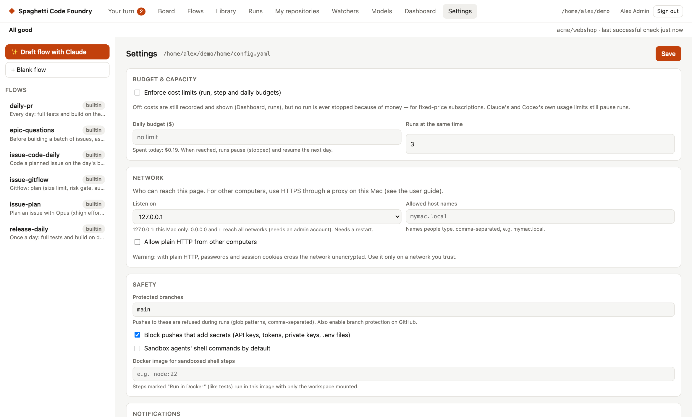

**Budget & capacity** — the daily budget stops new work when today's (estimated) spend reaches
it; paused runs continue the next day. Flows can also cap one run (`limits.max_cost_usd`).

**Safety**

- **Protected branches** — pushes to these branches (default `main`, `master`, `develop`,
  `release/*`) are refused during runs, whoever tries. Claude Code is not allowed to run
  `git push` at all, and Codex's sandbox has no network access by default — pushing is a flow
  step.
- **Secret scan** — every push is checked for API keys, tokens, private keys, connection
  strings and `.env`/key files in the new commits. Findings are shown masked and the push is
  refused. A private-key header only counts when key data follows it, so code (or a test) that
  writes a PEM around a key it generates is fine. For a false positive, add
  `factory:allow-secret` to the line or a pattern to `.claude-factory/secret-allow` in the
  repository.
- **Risk gate** — in `issue-gitflow`, every plan gets a risk score (0–100) from Opus and from
  Codex; above 75 (`risk_threshold`) a human must `/approve` it before any code is written. See
  [The risk score](#the-risk-score).
- **Sandboxing** — *Sandbox agents' shell commands* limits what agents' shell commands can
  write to the run's workspace. Shell steps marked **Run in Docker** (like the test steps) run
  in the Docker image you set, with only the workspace mounted.
- **Approval steps** in flows let you decide before anything irreversible happens (the risk gate
  and the split approval are approval steps).

**Notifications** — macOS notifications and a Slack webhook tell you only when something new
lands in **Your turn** (a question, a risky plan or split, a release pull request, a failure, a
watcher error). Nothing is sent for progress. A run that succeeds is told only if you switch on
"Also notify when a run succeeds" (off by default; runs that finished before you switched it on are
not told).

- **Message:** it says who has to do what, for example "acme/app#7 — The step
  run_tests failed: its command ended with an error — look at the output of the step and fix the
  cause, then remove the `factory:failed` label to start over, or resume the run on its page to
  continue at the failed step." It is at most 300 characters; a long title or reason is
  shortened, the action never.
- **Grouped and throttled:** at most one notification every N minutes (default 5, at least 1).
  Items that appear in that time come as one message, for example "3 things need you". Each item
  is told once; it is told again only when its situation changes.
- **Quiet hours:** set "from" and "to" (this machine's clock, may cross midnight). Nothing is
  sent in that time; what is still waiting afterwards is sent then.
- **Daily summary** (optional): set a time. Once a day you get a short message, for example
  "Done since yesterday: 3 stories, 2 other runs. Waiting for you: 1. Expected today: 2 stories
  being built, release pull request around 17:00." It follows the throttle and quiet hours, and
  is skipped when there is nothing to say.
- **Click:** on macOS a click opens the item, if `terminal-notifier` is installed
  (`brew install terminal-notifier`, allow it in the macOS notification settings). It must be on
  the `PATH` the server runs with; run `scf service install` again after installing it. Without
  it the notification shows but a click does nothing. Settings says which case applies. Slack
  messages always carry an "Open" link.
- **Command:** your own command still runs for every finished run, as before, for the outcomes
  you tick ("Run the command when a run is:"), with `FACTORY_STATUS`, `FACTORY_RUN_ID`,
  `FACTORY_FLOW` and `FACTORY_MESSAGE` set.
- **Who sends:** the server (`scf ui` / `scf serve`) sends the macOS and Slack messages, also for
  runs started with `scf run`. Without a running server only the command runs.

**Bot identity** — by default commits and comments are made as you. Set a bot name/email and a
token (or a GitHub App) to make them as a bot instead.

**Disk** — every run keeps its workspace so you can inspect or resume it. Remove old ones here
or with `scf clean` (branches in your repositories are kept).

**Accounts.** `scf user` keeps accounts in `users.json` in the data folder. Each account has an id,
name, e-mail, role (`admin` or `user`), status (`active` or `blocked`), password hash, created time
and last sign-in. Only you can read the file (mode `0600`). A data folder that does not exist yet is
created with mode `0700`. Passwords are never stored: each one is hashed with scrypt, a 16-byte
random salt per account, N=32768, r=8, p=3 and a 64-byte key. The parameters are stored with each
hash (`scrypt$N=32768,r=8,p=3$<salt>$<key>`). A hash in any other form makes the file invalid.
Anyone who can run commands on the machine as you has admin rights: they can read the file or run
`scf user create --admin`. This includes the agent and shell steps of flows, which run as your
user. A file that cannot be read or is not valid is an error, never "no accounts".

The last admin that is not blocked cannot be demoted, blocked or deleted: the command says "make
another admin first", changes nothing and exits 1. Change a role with
`scf user role <e-mail> admin|user`. `scf user list` shows the last sign-in of each account
("never" when there is none).

**What a block or delete stops.** A blocked or deleted account cannot start anything new. The jobs it
queued are cancelled (the server checks every 2 seconds; a block made while the server was down is
handled at the next start, before any job starts). A job it queued never starts, also after a
restart. Its running runs finish, and runs that wait for approval stay as they are. An admin can
still resume, approve or reject such a run, and that job runs. `scf user block <e-mail> --stop-work`
also cancels the account's running runs and its runs that wait for approval; workspaces are kept.
The server acts on `--stop-work` once, when it sees it (about 2 seconds, or at the next start), and
it covers every run the account owns at that moment. An admin's resume made in that gap is
cancelled too. `scf user unblock` restarts nothing and removes a stop-work request the server has
not handled yet. Watchers of the account keep working: disable the watcher or change its owner. The
server log says how many runs it cancelled, with the account id only.

**Audit log.** Every `scf user` action that changes something (`create`, `password`, `role`,
`block`, `unblock`, `delete`) adds one line to `audit.jsonl` in the data folder (mode `0600`), for
example `{"time":"2026-10-02T09:46:46.000Z","by":"cli","action":"role","userId":"<id>","oldRole":"user","newRole":"admin"}`.
Only a role change has `oldRole` and `newRole`. A `block` line has `stopWork` (`true` when
`--stop-work` was given). No line holds a name, e-mail, password, hash or
token, and a failed action is not logged. If the file cannot be written, the command stops before
it changes anything. In the rare case that the line cannot be added after the change (for example a
full disk), the command says so and exits 1. The file is a record, not a protection: anyone who runs
commands as you can edit it.

**Sign-in and sessions.** The UI and its API need a signed-in account; only the sign-in, sign-out
and first-admin calls and the static files are open. A session is kept on the server in
`sessions.json` (mode `0600`): it holds only a SHA-256 of the session token, never the token. It
lasts 7 days from sign-in and is not renewed. Sessions survive a restart and move with the data
folder. The browser holds the token in the cookie `scf_session_<port>` (`HttpOnly`,
`SameSite=Strict`); the port is in the name because `localhost` cookies are shared between ports.
The cookie gets the `Secure` flag when you reach the UI over HTTPS (through a proxy, see
[Access from other computers](#access-from-other-computers)); over plain HTTP on this machine it has none.
- **CSRF.** Every call that changes something must send the header `X-CSRF-Token` with the token
  the server gave at sign-in; otherwise it gets 403. The UI does this for you. Requests from a
  foreign origin or host are refused as before.
- **Wrong passwords.** After 10 wrong tries for one e-mail in 15 minutes, sign-in answers 429
  for that e-mail until the 15 minutes are over. A server restart also clears the count. The
  answer for a wrong password and for an unknown e-mail is the same.
- **Ending sessions.** Signing out, expiry, `scf user password` and `scf user block` end sessions.
  A run log that is open in the browser stops within 5 seconds. A role change does not end
  sessions; the new role counts from the next call.
- **Problems with the files.** If `users.json` or `sessions.json` cannot be read or written, or
  another `scf` process holds the lock, sign-in shows "sign-in is not working; see the server
  log". The log names the file and the kind of problem, never a password or a hash.

#### Roles and permissions

Every account has a role, `admin` or `user`. The server checks it on every call. A call that is
not in the table below answers 404, also for an admin.

- **An admin** may make every call and sees every page.
- **A user** sees only the **Runs** page and may use the calls marked `yes` or `own runs` in the
  table. Every other call answers `403 {"error":"not allowed for your role"}`. Pages other than
  Runs are not drawn; the address bar goes back to `#/runs`.

**What a user does not see.** The server cuts these from every answer a user gets, so the page
cannot show them: costs, tokens, budgets and prices; the model, provider and agent; step output
and transcripts (`GET runs/:id/transcript/:n` is for admins only); tool arguments in the log;
settings, folders and the raw reason of a failure; hidden variables of the flow. A user sees the
status, the log (steps and tool names), the questions and approvals, the steps with their result,
and the changes. A limit reads "the administrator's limit was reached". An unexpected error
answers "something went wrong on the server; ask the administrator" and the details go to the
server log. Notifications are not changed: they go to your channels with your wording, also for
runs users started, so the Slack webhook should not point at a channel users read.

**Your own runs.** A run has an owner: the account that started it. A user sees and may follow,
cancel, resume, approve, reject and read only their own runs. Another account's run, an unknown
run and a run without an owner all answer `404 {"error":"run not found"}`, so a guessed id tells
nothing. A run started by a watcher belongs to the watcher's `owner` (an account's e-mail, set by
an admin; empty: the first admin). Runs from the command line and from evals belong to the first
admin. A queued run that has not started yet already counts as its owner's. An admin may use
every run.

**After an upgrade.** Runs from older versions have no owner. The first admin gets them at the
next server start, when the first admin is created on the setup page, and within a minute of
`scf user create --admin` while the server runs. A run that is still live is handed over after
it ends.

**The queue.** A user sees only their own queued runs. Runs of other accounts in front of them
show as "n runs ahead of you", without ids.

**Answering a run.** On a run that waits, a user can approve or reject it with a note
(`POST /api/runs/<id>/approve` or `/reject` with `{"note": "…"}`). The note reaches the run.

**Repositories.** Every account has its own list of GitHub repositories, kept in `repos.json` in
the data folder (mode `0600`). Three calls manage it:

- `GET /api/repos` lists your repositories.
- `POST /api/repos {"name": "owner/name"}` adds one (201; 409 if you have it; 400 for a bad name;
  at most 50).
- `DELETE /api/repos/<owner>/<name>` removes one (404 if you do not have it).

A name is `owner/name` with letters, digits, `-`, `_` and `.`. The placeholder `owner/repo` and
names like `a/..` are refused. Case does not matter when names are compared. If `repos.json`
cannot be read, the calls answer "the repository list is not working; see the server log".

**Which flows a user may start.** A user starts a *published* flow by name (`POST /api/runs
{"flow": "<name>", "task": "…", "vars": {…}}`), never by `yaml` (403 "only an admin can run a
flow that is not saved") and never in a folder of their choice (403 "only an admin can choose
the folder"). A flow is published when its `publish:` section has `enabled: true` (see "The
editor"). Built-in flows are not published; save a copy and publish it. After an upgrade users
see no flows until you publish some. An unpublished flow answers 404.

`GET /api/flows` shows a user the published, valid flows as `{name, title, description,
version, fields}`. `fields` lists the variables that are *fixed* (shown with their value) or
*user fills in* (with label, help text, default and whether it is required); hidden variables
are not listed. In `vars` a user may set only the inputs (403 `you cannot set the var "<name>"`
for any other). A required input that is empty gives 400 `fill in "<label>"`. Hidden and fixed
variables keep the value of the flow or of the folder's own settings.

If the flow uses `github_repo`, it must be one of the user's repositories: when it is an input,
give it in `vars` (403 `"<name>" is not one of your repositories`). When none is given and the
flow or the folder's own settings name a repository that is not the user's, the answer is 403
`set the var "github_repo" to one of your repositories` (or, when `github_repo` is not an input,
`this flow works on a repository that is not one of yours`). A flow without `github_repo` runs
in the server's default folder. A user's run keeps the variables it had when it was queued.

**Versions.** Each save of a published flow sets `publish.version`: 1 the first time, then one
more for each change (compared with every same-named copy, in all places). Saving it unchanged
keeps the number; turning the flow off and on again raises it. A run keeps the flow it started
with, even if you save a new version while it waits, and the run page shows "Flow version". If
you edit a flow file by hand, raise the number yourself.

**Trust.** Roles limit the API and the pages. They do not limit what a run can do. A user who can
start a run can run commands as your Mac user (through the task and variables such as
`test_cmd`), with the server's GitHub access. That is the same as admin rights. Give a user
account only to people you would give an admin account. To switch user runs off, change the rule
`POST runs` to `no` in `src/server/permissions.ts`.

**After an upgrade.** Existing accounts with the role `user` lose access to everything but Runs.
Change a role with `scf user role <e-mail> admin|user`, or create an admin with
`scf user create --admin` under another e-mail.

**The table.** An admin may make every call.

| Call | Admin | User | What it does |
|---|---|---|---|
| `GET /api/info` | yes | no | server settings and today's cost |
| `GET /api/config` | yes | no | read the settings |
| `PUT /api/config` | yes | no | change the settings |
| `GET /api/watchers` | yes | no | list the watchers |
| `POST /api/watchers/:id/tick` | yes | no | run a watcher now |
| `POST /api/clean` | yes | no | clean up old runs |
| `GET /api/providers` | yes | no | agent providers |
| `POST /api/providers/test` | yes | no | test a provider |
| `GET /api/evals` | yes | no | eval reports |
| `GET /api/stats` | yes | no | statistics |
| `GET /api/flows` | yes | yes | list flows (a user sees the published flows only) |
| `GET /api/flows/:name` | yes | no | read a flow |
| `PUT /api/flows/:name` | yes | no | save a flow |
| `DELETE /api/flows/:name` | yes | no | delete a flow |
| `GET /api/blocks` | yes | no | list blocks |
| `PUT /api/blocks/:id` | yes | no | save a block |
| `DELETE /api/blocks/:id` | yes | no | delete a block |
| `POST /api/validate` | yes | no | check a flow |
| `POST /api/generate` | yes | no | write a flow with AI |
| `GET /api/queue` | yes | yes | the queue (a user sees their own queued runs and how many are ahead) |
| `GET /api/runs` | yes | yes | list runs (a user sees their own) |
| `GET /api/run-owners` | yes | no | the accounts that have runs, for the owner filter |
| `POST /api/runs` | yes | yes | start a run (a user: a published flow and own repositories) |
| `GET /api/runs/:id` | yes | own runs | read a run (a user: without costs and setup) |
| `POST /api/runs/:id/cancel` | yes | own runs | cancel a run |
| `POST /api/runs/:id/resume` | yes | own runs | resume a run |
| `POST /api/runs/:id/approve` | yes | own runs | approve a run, with a note |
| `POST /api/runs/:id/reject` | yes | own runs | reject a run, with a note |
| `GET /api/runs/:id/events` | yes | own runs | follow a run live (a user: without costs and setup) |
| `GET /api/runs/:id/diff` | yes | own runs | the changes of a run |
| `GET /api/runs/:id/transcript/:n` | yes | no | the transcript of a step |
| `GET /api/next` | yes | no | what happens next, for all runs |
| `GET /api/health` | yes | no | server health |
| `GET /api/board` | yes | no | the board of all work |
| `GET /api/since` | yes | no | what changed since a time |
| `GET /api/your-turn` | yes | no | what waits for you |
| `POST /api/your-turn/dismiss` | yes | no | dismiss an item |
| `POST /api/your-turn/restore` | yes | no | restore dismissed items |
| `GET /api/credentials` | yes | yes | your stored credentials |
| `POST /api/credentials` | yes | yes | store a credential |
| `DELETE /api/credentials/:id` | yes | yes | remove a credential |
| `GET /api/repos` | yes | yes | your repositories |
| `POST /api/repos` | yes | yes | add a repository |
| `DELETE /api/repos/:owner/:name` | yes | yes | remove a repository |

**What comes later.** Runs that use a user's stored credentials, changing your own password in
the UI, and pages for users (starting runs, repositories).

### Access from other computers

By default the Foundry answers only on the Mac it runs on. Colleagues can reach it from their own
computers when you set three things in **Settings → Network** (or in `config.yaml`):

```yaml
server:
  listen: 127.0.0.1              # 127.0.0.1 (default), ::1, 0.0.0.0 or ::
  allowed_hosts: [mymac.local]   # names people type; a port is optional
  allow_insecure_http: false     # true: also accept plain HTTP from other computers
```

- `listen` is the address the server binds. `0.0.0.0` and `::` answer on every network; the other
  two only on this Mac. Only these four values are allowed. A change needs a restart.
- `allowed_hosts` replaces the old fixed localhost check. `localhost`, `127.0.0.1` and `[::1]` (with
  the server port) always work. Any other `Host` header must be listed, else the answer is
  `403 forbidden host`. A change applies at once.
- `allow_insecure_http` is off by default. A change applies at once.

**The safe way: HTTPS through Caddy on the Mac.** The Foundry has no TLS of its own. A proxy on the
same Mac does the HTTPS and talks to the Foundry on `127.0.0.1`.

1. Keep `listen: 127.0.0.1`. Add the Mac's name to the allowed host names. Use the local host name
   from System Settings → General → Sharing, for example `mymac.local`. Colleagues must be able to
   resolve that name (macOS does it on the same network; other systems may need a DNS or hosts entry).
2. Install Caddy: `brew install caddy`.
3. Write the Caddyfile. Homebrew's service reads `$(brew --prefix)/etc/Caddyfile`:
   ```
   mymac.local {
       tls internal
       reverse_proxy 127.0.0.1:4777
   }
   ```
4. Start it: `brew services start caddy` (it starts again at login). After a change:
   `brew services restart caddy`. To try it once in a terminal: `caddy run --config <file>`.
5. Trust the certificate on the Mac itself: `caddy trust`.
6. Give your colleagues Caddy's root certificate, `root.crt`. Caddy keeps it in its data folder, by
   default `~/Library/Application Support/Caddy/pki/authorities/local/root.crt` when it runs as your
   user. Check that the file exists on your Mac. On macOS, open it with Keychain Access, add it to
   **System**, then set it to **Always Trust**. On Windows, import it into **Trusted Root
   Certification Authorities**. Firefox has its own certificate store.
7. Check it:
   - `curl --cacert root.crt -sI https://mymac.local/` shows `200` and `strict-transport-security`.
   - `curl -s -H 'Host: mymac.local' http://127.0.0.1:4777/` answers `HTTPS required`.

**What any proxy must do.**
- Run on the same Mac and connect to `127.0.0.1:<port>`. The Foundry believes forwarded headers
  only from a connection that comes from this Mac.
- Pass the `Host` header unchanged, with its port.
- Set `X-Forwarded-Proto` itself from the real connection (overwrite what the client sent, never
  pass it on) and send `X-Forwarded-For`.
- Not buffer responses (the run log is a stream).

Caddy does all of this by default. For nginx use `proxy_set_header Host $http_host;
proxy_set_header X-Forwarded-Proto $scheme; proxy_set_header X-Forwarded-For $proxy_add_x_forwarded_for;
proxy_buffering off;` (`$host` drops the port, so use `$http_host`). A proxy that rewrites `Host` to
`127.0.0.1:4777` and sends no forwarded headers makes remote requests look local; do not use one.

**Plain HTTP on a trusted network.** Set `listen: 0.0.0.0`, add the Mac's name or address to the
allowed host names and switch on `allow_insecure_http`. **Warning:** passwords and session cookies
then cross the network unencrypted. Use it only on a network you trust.

**What the server does.**
- Over HTTPS (through the proxy) the session cookie is `Secure` and responses carry
  `Strict-Transport-Security` (one year).
- Every response carries a strict `Content-Security-Policy` (only this server's own scripts and
  styles) and `X-Content-Type-Options: nosniff`.
- A change (POST, PUT, DELETE) with an `Origin` header must come from exactly the address you used:
  same scheme, name and port.
- Requests from other computers are refused with `HTTPS required` unless they come through the
  proxy over HTTPS, or `allow_insecure_http` is on.
- The server does not start on `0.0.0.0` or `::` until an admin account exists.
- The first admin can only be created on the Mac itself, not through the proxy.
- Settings cannot be saved if the change would lock out the browser that saves it (its host name
  removed, or a `listen` value that does not cover the address it is connected to).
- Sign-in is also limited per client address (60 tries in 15 minutes) and to 16 password checks at
  the same time; an e-mail longer than 254 characters is a wrong sign-in.

**Restart** after changing the address: stop and start `scf ui`, or run `scf service install` again.

**Do not mix** HTTPS and plain HTTP on one host name: HSTS makes browsers refuse HTTP for that name
for a year.

A user account can only use Runs and the calls in "Roles and permissions" above, but a run can
still run commands on this Mac, so only give accounts to people you trust. Links
in Slack and notifications still point at `http://localhost:<port>`.

**Stored credentials.** A token or an ssh key can be stored through the API
(`POST /api/credentials`); there is no UI page yet, and runs do not use them yet. They are kept in
`credentials.json` in the data folder (mode `0600`), encrypted with AES-256-GCM. The key is not in
the data folder: it is in the macOS Keychain, as an item of the service
`claude-factory-credential-key`. Only macOS is supported.
- **What the API shows.** Only type, name, created, last used and the fingerprint, never the
  secret. A token must be 8 to 4096 printable ASCII characters on one line. To check a fingerprint:
  `printf %s "$TOKEN" | shasum -a 256`, the first 16 digits.
- **Redaction.** A stored secret is replaced by `[redacted]` in step output, logs, transcripts,
  errors and API answers. Limits: text written before a credential was saved stays on disk (the API
  hides it), the task text and other encodings (such as base64 of `user:token`) are not matched.
  If credentials exist and the Keychain is locked or the key is gone, runs fail before they start
  and the API shows nothing until that is fixed.
- **Deleting.** Deleting a credential or a user (`scf user delete`) replaces the key, so older
  copies of `credentials.json` are useless. `scf credential rotate-key` does the same on demand.
- **Who can read the key.** Anyone who runs commands as your macOS user, flow steps included. The
  encryption protects copies of the data folder: backups, sync, another user.

Global settings are stored in `~/.spaghetti-code-foundry/config.yaml`; runs in `~/.spaghetti-code-foundry/runs/`.

---

## 8. Costs, dashboard and evals

### What the dollar amounts mean

The costs shown are **estimates at API prices**, as reported by Claude Code. Whether you pay
them depends on how the agents are logged in:

- Claude Code with a **Claude subscription** (Pro/Max): no per-token charges; usage counts
  toward your plan's limits.
- Claude Code with an **API key** (`ANTHROPIC_API_KEY`): billed per token — the amounts are
  real.
- Codex with your **ChatGPT login**: included in your ChatGPT plan; recorded as $0 with the
  token count. With `CODEX_API_KEY` you can set a price per token for the provider.
- **Local models**: free, recorded as $0.

Budgets use these amounts either way, so they also protect your subscription limits.

**Fixed-price subscriptions:** turn off **Enforce cost limits** in Settings (`cost_limits: false`).
Costs are still recorded and shown everywhere, but nothing is ever stopped because of money — no
run limit, no step limit, no daily budget. The usage limits that Claude and Codex report
themselves still pause runs; they continue by themselves when the limit resets.

### Dashboard

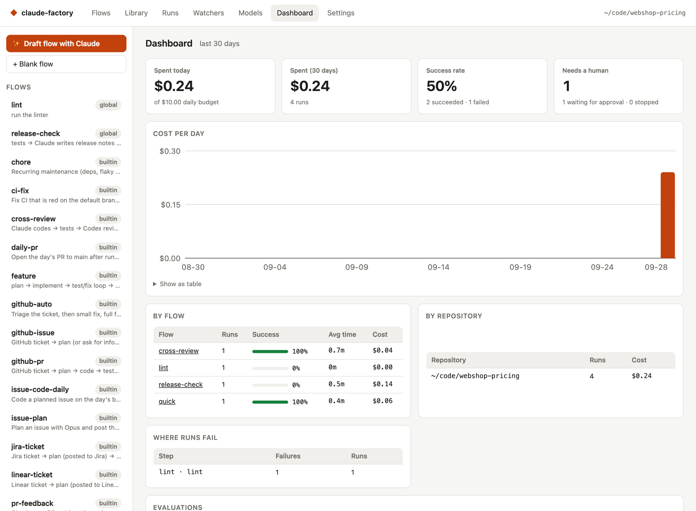

Spend today and over 30 days, success rate, **Needs a human** (the number of runs whose next
move is yours — the same as **Needs you** on the Runs page), the **Waiting** card (every
labelled issue that isn't being worked on: who has the next move, what to do, why, and a link;
lines for you come first), cost per day, results per flow and per repository,
the steps where runs fail most, and eval results. A server that waits to restart shows in the
[health line](#the-health-line), not on the Dashboard.

### Evals

An eval suite runs sample tasks through one or more flows and models and scores them, so you
can compare, for example, Sonnet, Codex and a local model on your own code:

```yaml
# evals/my-suite.yaml
name: my-suite
flows: [quick]
cases:
  - name: add-multiply
    repo: fixtures/calc            # a folder or git repo, relative to this file
    task: Add a multiply(a, b) function to calc.js.
    vars: {test_cmd: node --test}
    check: node --test             # exit 0 = pass
```

```bash
scf eval evals/my-suite.yaml --models sonnet,codex,ollama:qwen3-coder
```

The report shows pass rate, average cost, tokens, time and fix loops per variant, and appears on
the Dashboard.

---

## 9. Command line

The command is `scf`. `factory` still works as an alias and prints a short note.

| Command | What it does |
|---|---|
| `scf ui [--port 4777] [--no-open]` | Web UI, queue and watchers. Restarts itself when a new build is installed and no run is active (set `SCF_NO_SUPERVISE=1` to turn that off) |
| `scf serve [--port 4777]` | The same without opening a browser |
| `scf service install \| uninstall \| status` | Run `scf serve` in the background (macOS) |
| `scf run <flow> --task "…" [--var k=v] [--repo dir]` | Run a flow |
| `scf resume <run-id> [--from <step>]` | Continue a run |
| `scf approve <run-id> [--note "…"]` / `scf reject …` | Decide on a waiting run |
| `scf flows` / `scf blocks` | List flows / library blocks |
| `scf new <name> [--from <flow>] [--global]` | Create a flow from a template |
| `scf validate <flow or file>` | Check a flow |
| `scf flow-guide` | Print the flow-writing guide for AI assistants ([Let any AI write a flow](#let-any-ai-write-a-flow)) |
| `scf watch [flow] --var github_repo=o/r [--source …] [--once]` | Run one watcher from the terminal |
| `scf eval <suite.yaml> [--flows a,b] [--models …]` | Run an eval suite |
| `scf clean [--older-than 7] [--purge] [--dry-run]` | Remove old run workspaces |
| `scf user create [--admin] [--name n] [--email e]` | Create an account. The first one needs `--admin`. Name and e-mail are asked for on a terminal |
| `scf user list` | List accounts with the last sign-in (never shows passwords or hashes) |
| `scf user role <e-mail> admin\|user` | Change the role of an account (not the last admin); counts from the next call |
| `scf user password <e-mail>` | Set a new password and sign the account out |
| `scf user block <e-mail> [--stop-work]` / `scf user unblock <e-mail>` | Block (and sign out) or unblock an account (not the last admin). Queued jobs are cancelled; `--stop-work` also cancels running and waiting runs |
| `scf user delete <e-mail>` | Delete an account, its sessions and its stored credentials (not the last admin) |
| `scf credential rotate-key` | Re-encrypt all stored credentials under a new key |
| `scf credential check` | Check that the macOS Keychain can store, read and remove the key |

The password is asked twice on a terminal, or read from the first line of stdin; it is never an
option or an environment variable. No command needs a signed-in session; only the web UI does.

### Environment variables

Both names work; if both are set, `SCF_…` wins.

| Variable | Old name | What it does |
|---|---|---|
| `SCF_HOME` | `FACTORY_HOME` | Data folder (default `~/.spaghetti-code-foundry`) |
| `SCF_CLAUDE_BIN` | `FACTORY_CLAUDE_BIN` | Claude Code program to run |
| `SCF_CODEX_BIN` | `FACTORY_CODEX_BIN` | Codex program to run |
| `SCF_GH_BIN` | `FACTORY_GH_BIN` | `gh` program to run |
| `SCF_NO_OPEN` | `FACTORY_NO_OPEN` | Set to `1` to not open a browser |
| `SCF_NO_SUPERVISE` | `FACTORY_NO_SUPERVISE` | Set to `1` to not restart the server on a new build |
| `SCF_NO_NOTIFY` | `FACTORY_NO_NOTIFY` | Set to `1` to turn notifications off |
| `SCF_LOCK_DIR` | `FACTORY_LOCK_DIR` | Where lock files are kept |

Flows are looked up in `<repo>/.claude-factory/flows/`, then `~/.spaghetti-code-foundry/flows/`, then the
built-in ones.

---

## 10. Troubleshooting

**`forbidden host`, `HTTPS required` or `forbidden origin` from another computer.**
`forbidden host`: add the name you typed to the allowed host names. `HTTPS required`: use the HTTPS
proxy and check that it sends `X-Forwarded-Proto`. `forbidden origin` behind a proxy: the proxy
changes `Host` (or drops its port), or does not send `X-Forwarded-Proto: https`. If the server exits
with "cannot listen on …", create the admin first with `scf user create --admin`.

**Nothing is happening to an issue.** First look at the [health line](#the-health-line) under the
top bar: it says when the Foundry itself is the problem. Then look at the **Waiting** card on the Dashboard — it says
who has the next move (the badge at the start of the line), what to do and why. See also [Why is nothing happening?](#why-is-nothing-happening).

**A plan is waiting for approval.** Its risk score is above 75, or the issue has
`Factory_review_plan`. Read the plan on the issue and reply `/approve` (with notes if you like)
or `/reject` with what to change.

**The release pull request is a draft.** The daily full test run or build failed on it; the
daily report or release check starts with `**Nothing needed from you** — it stays a draft until the checks pass.`
and has the failing output. It becomes ready again when a later report passes.

**A run failed, or a watcher shows an error.** The message says what happened, why, and what
you can do first. Find yours in the table:

| Message | What you can do |
|---|---|
| The step … failed: its command ended with an error | Look at the output of the step and fix the cause |
| The step … failed: it ran longer than its time limit | Look at the output of the step to see what took so long |
| The step … failed: the agent stopped without a result | Look at the log of the step on the run page |
| The step … failed: the agent stopped with an error | Look at the log of the step on the run page |
| The step … failed: the agent used all its turns | Look at the log of the step on the run page |
| The step … failed: the agent hit an error while it worked | Look at the log of the step on the run page |
| The step … failed: the agent used up the budget of the step | Give the step a larger budget in the flow |
| The step … failed: the agent ended with an error | Look at the log of the step on the run page |
| The step … failed: it used all its attempts | Look at why the step keeps failing in its log on the run page |
| The run reached its budget: it used the amount the flow allows for one run | Allow a larger budget for one run in the flow |
| The step … failed: a person rejected it | Read the note of the person and change the work as asked |
| The step … failed: Codex is not installed on this computer | Install Codex on the computer that runs the Foundry |
| The step … failed: Codex is not logged in | Log in to Codex on the computer that runs the Foundry |
| The run failed: the Foundry hit an error of its own | Look at the steps and the log on the run page |
| The run failed: no reason was saved | Look at the steps and the log on the run page |
| The run failed: the error is not one the Foundry can explain | Look at Details on the run page |
| The watcher for … can't reach GitHub: GitHub did not answer or did not let it in | Check the network and `gh auth status` |
| The watcher for … cannot reach the repository: a call to GitHub failed | Check that gh is logged in and the repository is there |
| The watcher for … did not finish its check: it took too long and was given up | Press Check now on the Watchers page to try again |
| The watcher for … cannot start: its check interval is not a valid time | Change the check interval of the watcher to a time like 5m |
| The watcher for … cannot start: its check interval is outside what is allowed | Change the check interval of the watcher to a time like 5m |
| The watcher for … has an error: the error is not one the Foundry can explain | Look at Error details on the Watchers page |

Then the message adds how to try again. A failed run can be resumed on its page to continue at
the failed step, or (for an issue the Foundry watches) you remove the `factory:failed` label to
start over. When the fix is a change to the flow (a larger budget), only a new run counts: a
resumed run keeps the flow it started with. A change in Settings, such as the cost limits, also
counts for a resume.

The raw text is still there, as a detail: under **Details** on the run page and inside each
failed step of the **Steps & transcripts** list, under **Error details** on the watcher card,
and inside the collapsed **Details** of the failure comment on the issue. The settings behind
the messages are `max_visits` (attempts), `limits.max_cost_usd` (run budget), `max_budget_usd`
(step budget) and `timeout_sec` (time limit). If a step only needs more time, raise
`timeout_sec` and start over.

A watcher error names its repository and shows in the [health line](#the-health-line). For a
connection problem, check the network, and that `gh auth status` works in the terminal where the
Foundry runs and that you have access to the repository. **Error details** on the watcher card
shows gh's first output line too. **Check now** on the Watchers page retries
immediately. A "has not checked since …" line means no check finished for a long time (a check
that takes over 10 minutes is given up).

**"Codex is not installed" or "Codex is not logged in".** Install Codex (`npm i -g
@openai/codex`, or the ChatGPT desktop app) and run `codex login`. The Models page shows the
status.

**A local model says it is done but changed nothing.** The model is not good at tool use. Try a
coding model (`qwen3-coder`, `gpt-oss`) and use **Try a model** on the Models page.

**A run stopped with "daily budget reached".** It continues automatically the next day, or when
you raise the budget and resume it.

The failure comment starts with what you need to do.

**The Foundry failed, not the code.** The run says so when an agent command was blocked, a
marker could not be read, a push hit a protected branch or a setting is broken. Do what the
sentence says (e.g. allow the command in the flow), then resume the run. The label stays the
failed label.

**A push was refused.** Either the branch is protected, or the secret scan found something.
A protected branch is a setting to change (**Protected branches** in Settings, or the flow's
branch); the run then says the Foundry failed. A secret-scan finding is in the code: the step
output lists the file, line and kind of secret.

**Forgot the password.** Run `scf user password <e-mail>` on the machine. If no admin is left, run
`scf user create --admin`.

**The credential store is not working.** Run `scf credential check`. Unlock the login keychain if
it fails. If the key is gone (for example the data folder was copied from another Mac), delete
`credentials.json` and add the credentials again. "An old key is still in the Keychain" means a
removal failed after a delete or rotation; `scf credential rotate-key` clears it.

**Tests fail for reasons unrelated to the change.** Set the right command with the `test_cmd`
variable, per repository in `<repo>/.claude-factory/config.yaml`.

---

## 11. Upgrading from claude-factory

The data folder is now `~/.spaghetti-code-foundry` (or `SCF_HOME` / `FACTORY_HOME` if you set one).
The `.claude-factory/` folder inside each repository does not change.

**What happens.** On the first start of any `scf` command except help, the whole
`~/.claude-factory` folder is copied to `~/.spaghetti-code-foundry`: config, runs, flows, blocks,
learnings, queue, locks and evals. The copy is made next to the new folder and renamed into place
in one step, so you never see a half-done move. Paths that point into the old folder (in run state,
lock files, `queue.json` and `config.yaml`) are rewritten. If `config.yaml` can't be rewritten
safely, it is kept as it was and a warning lists the values that still point to the old folder.
`users.json`, `sessions.json` and `credentials.json` are copied unchanged, with their mode.

**The backup.** `~/.claude-factory` is never changed or deleted, except for a note file
`MOVED-TO-SPAGHETTI-CODE-FOUNDRY.txt`. Nothing there is used anymore: your settings now live in
`~/.spaghetti-code-foundry/config.yaml`, and the old `~/.claude-factory/config.yaml` is only a copy.
You can delete the folder once everything works.

**When the move waits.** Nothing is copied when you set `SCF_HOME` / `FACTORY_HOME`, when the new
folder already exists (it is never overwritten), while a run is running, when free space is short
(size + 10% + 100 MiB), or when something in the old folder changed while it was copied. The move is
tried again on later starts, and every minute by an idle `scf ui` / `scf serve`. A run counts as
running when its `run.json` can't be read, or its status is `running` and it has no recorded `pid`
(from the old version) or its `pid` is alive. The message names these runs. For a run that crashed,
run `scf resume <id>` (or delete a leftover run folder without `run.json`).

**Worktrees.** Runs that use a git worktree are repaired with `git worktree repair`, so a waiting
run can be approved and resumed in the new folder. The workspaces left in the backup are no longer
linked to your repositories. If a repair fails, everything is put back and the old folder stays in
use. If an interrupted move left the repair unfinished, the next start finishes it.

**Servers on the old folder.** A running `scf ui` or `scf serve` that still uses the old folder
refuses changes after the move (HTTP 503) and restarts onto the new folder when it is idle. Other
processes on the old folder refuse to start runs; restart them. Stop old `factory watch` processes
before you upgrade: they run old code and can't join the lock the move uses.

**If the new folder is missing.** When the note exists but `~/.spaghetti-code-foundry` is gone,
`scf` refuses to run (help still works) and never copies the backup a second time by itself. Restore
the folder, set `SCF_HOME` to the folder you want, or delete the note file to copy again.

**Login service.** Run `scf service install` once, so its log and settings move to the new folder.
`scf service status` tells you when it is still needed.

**The command.** If `factory` still points at the old install, run
`npm unlink -g claude-factory && npm link` in the repository.

**The repository.** It is now `MeloMar-IT/spaghetti-code-foundry`. GitHub redirects the old
address. In an existing clone, run
`git remote set-url origin https://github.com/MeloMar-IT/spaghetti-code-foundry.git`.
The folder of your clone can keep its name.
