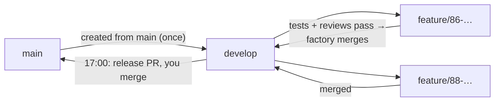

# claude-factory user guide

claude-factory runs **flows**: pipelines of steps that code, test, review and ship changes with
AI coding agents on your own machine. This guide walks through the web UI, writing your own
flows, automating work from GitHub, choosing models, and keeping it all safe.

- [1. Start](#1-start)
- [2. Run a flow](#2-run-a-flow)
- [3. Follow, approve and resume runs](#3-follow-approve-and-resume-runs)
- [4. Write your own flows](#4-write-your-own-flows) — or [let any AI write one](#let-any-ai-write-a-flow)
- [5. Models, agents and routing](#5-models-agents-and-routing)
- [6. Automate with watchers](#6-automate-with-watchers)
  - **[Label cheat sheet: which label does what](#the-label-pipeline-one-label--plan--code--one-pull-request)**
- [7. Settings and safety](#7-settings-and-safety)
- [8. Costs, dashboard and evals](#8-costs-dashboard-and-evals)
- [9. Command line](#9-command-line)
- [10. Troubleshooting](#10-troubleshooting)

---

## 1. Start

Install it (see the [README](../README.md)), then start the UI from the repository you want
to work on:

```bash
cd ~/code/my-project
factory ui
```

The UI opens at **http://localhost:4777**. It only listens on your own machine. The path in the
top-right corner is the repository runs work on by default.

| Page | What it is for |
|---|---|
| **Flows** | Your flows and the built-in ones: edit, create, run |
| **Library** | Reusable blocks of steps to drop into flows |
| **Runs** | Everything that ran or is running; the ones that need you on top |
| **Watchers** | Automatic runs from GitHub issues, PR comments, red CI, or a schedule |
| **Models** | Which agents and models are available, and which model runs which step |
| **Dashboard** | Spend, success rate, where runs fail, eval results |
| **Settings** | Budget, safety, notifications, bot identity, disk clean-up |

Everything the UI does is also available from the command line (see [section 9](#9-command-line)).

---

## 2. Run a flow

Pick a flow on the left, press **▶ Run**, describe the task and start it.


- **Task** — what you want done, in plain language. Flows use it in their prompts.
- **Repository** — the local git repository to work on.
- **Variables** — settings the flow exposes, e.g. `test_cmd`. Leave `auto` to let the factory
  detect the test command (npm/pnpm/yarn, pytest, Go, Cargo, Gradle, Maven, Make).

**Your checkout is never touched.** Depending on the flow's *workspace* setting, a run works in:

| Workspace | Where the run works |
|---|---|
| `worktree` (default) | A new git worktree on a `factory/<run-id>` branch of your repository |
| `empty` | An empty folder; the flow clones what it needs (used by the GitHub flows) |
| `inplace` | Directly in the repository — only for flows you trust |

When a run finishes, its branch stays in your repository. Review it, merge it, or delete it.

---

## 3. Follow, approve and resume runs

### The runs list


Runs that wait for a decision or stopped with a question are listed under **Needs you**. At
most *N* runs execute at the same time (Settings → Runs at the same time); the rest queue.

### A run

Open a run to follow it live.


- **Live log** — each step as it starts and ends, with the agent's tool calls, duration, cost or
  tokens.
- **Steps & transcripts** — every step with its outcome. Open an agent step to read the whole
  conversation: what it said, each command it ran and the output, and the final result. The
  label next to the step name shows which agent and model ran it (here Claude on Haiku wrote the
  code, and Codex reviewed it).

  

- **Changes** — the complete diff the run made, including uncommitted work.

  

### Approvals

An **approval** step pauses the run until a person decides. Approve or reject in the UI, with
`factory approve <run-id>` / `factory reject <run-id>`, or — for GitHub flows — by commenting
`/approve` or `/reject` on the issue (only people with write access count).


### When something goes wrong

- **Resume** continues a stopped, failed, cancelled or interrupted run from the step where it
  stopped, with everything it already did kept. Fix the cause first (e.g. answer the question,
  fix the environment), then press **↻ Resume**.
- **Retry from step…** re-runs from any earlier step.
- **Cancel** stops a running run; you can resume it later.

Runs survive restarts: if the factory stops mid-run, the run is marked *interrupted* and can be
resumed (watchers do this automatically).

---

## 4. Write your own flows

### The editor


Edit a flow **visually** (left) or as **YAML** (tab at the top). The graph on the right shows
how steps connect: grey = next, green = on success, red dashed = on failure, purple = route.


- **Save to** — *this repo* (`<repo>/.claude-factory/flows/`, shared with your team through git)
  or *global* (`~/.claude-factory/flows/`, just for you). Saving a built-in flow creates your own
  copy that overrides it.
- **✨ Draft flow with Claude** — describe what you want and Claude writes the YAML.
  **Ask Claude** changes the open flow the same way.
- **+ From library** inserts a block from the [Library](#the-block-library).

### Let any AI write a flow

[`docs/FLOW_AUTHORING.md`](FLOW_AUTHORING.md) is a complete, self-contained description of the
flow format written for AI assistants: every field, step type, template and environment
variable, the common patterns (test/fix loops, review gates, asking a human, pull requests), a
checklist and a full example. Give it to any assistant — ChatGPT, Claude, Gemini, Codex or a
local model — and describe the flow you want:

```bash
factory flow-guide > flow-guide.md        # or copy docs/FLOW_AUTHORING.md
```

1. Paste (or attach) the guide in a new chat, then write what the flow should do, e.g. *"Opus
   plans a database migration, I approve the plan, Sonnet implements it with pytest tests, up to
   3 fix rounds, Codex reviews once, then push the branch and open a PR."*
2. Save the YAML it answers with as `<repo>/.claude-factory/flows/<name>.yaml` (or in
   `~/.claude-factory/flows/`).
3. Check it: `factory validate <name>` — it names the field and step for anything that is wrong;
   paste that back to the assistant to fix it. Then open it in the editor to see the graph.

**✨ Draft flow with Claude** in the editor uses the same guide, so both ways produce the same
kind of flow. The examples in the guide are checked by the test suite, so they always match the
current format.

### Step types

| Type | What it does |
|---|---|
| **Agent** (`type: claude`) | Runs Claude Code or Codex with a prompt |
| **Shell** | Runs a command; exit code 0 = success |
| **Approval** | Pauses until a person approves (→ on success) or rejects (→ on failure) |
| **Parallel** | Runs several agent/shell steps at once; succeeds when all succeed |
| **Sub-flow** | Runs another flow inline, in the same workspace |

### Controlling the path

Steps run top to bottom. Each step can change that:

- **On success / On failure** — `next` (default on success), `fail` (default on failure), `end`
  (finish as succeeded), `stop` (pause for a human), or a step id to jump to.
- **Routes** — on success, jump to a step when the output matches a pattern, e.g.
  `^ROUTE: small` → `quick_fix`. The first match wins.
- **Pass if / Fail if** — patterns that decide success from the output, e.g. an agent that must
  end with `VERDICT: APPROVE`.
- **Only reachable via jumps** — the step is skipped in the normal order (for fix-up handlers).
- **Max visits** — how often a step may run in one run (default 5); guards loops like
  test → fix → test.
- **When resumed, restart at** — for a step that stops the run, where a resume should continue.

A typical fix loop:

```yaml
steps:
  - id: implement
    type: claude
    prompt: "{{task}}"

  - id: run_tests
    type: shell
    run: npm test
    on_failure: fix_tests

  - id: fix_tests
    type: claude
    jump_only: true
    max_visits: 3
    prompt: |
      The tests fail. Fix the code.
      {{steps.run_tests.output}}
    on_success: run_tests
```

### Passing information between steps

In **agent prompts** you can use:

| Template | Value |
|---|---|
| `{{task}}` | The run's task |
| `{{vars.name}}` | A flow variable |
| `{{steps.<id>.output}}` | Output of an earlier step (also `.ok`, `.exit_code`) |
| `{{learnings}}` | Lessons saved by earlier runs in this repo |
| `{{run.history}}` | Which steps ran so far and how they ended |
| `{{workdir}}`, `{{run.id}}`, `{{run.branch}}` | Where and what this run is |

**Shell commands** may only template trusted values (`{{vars.*}}`, `{{workdir}}`, `{{run.*}}`).
Task text and step outputs could contain anything, so shell steps read them from environment
variables instead: `$FACTORY_TASK`, `$FACTORY_OUT_<STEP_ID>`, `$FACTORY_VAR_<NAME>`,
`$FACTORY_RUN_ID`, `$FACTORY_BRANCH`.

An agent step can **continue the session** of an earlier agent step ("Continue session of"), so
it remembers the conversation.

### Variables

Flow variables (`vars:`) have defaults in the flow and can be overridden per run, per watcher,
or per repository in `<repo>/.claude-factory/config.yaml`:

```yaml
vars:
  test_cmd: ./gradlew test
```

### The block library


Blocks are ready-made groups of steps: pull a GitHub issue, plan, code, run tests with a fix
loop, code review, cross-review by Codex, commit, push, open a PR, wait for CI, secret scan,
Jira and Linear, and more. Insert one with **+ From library** in the editor. Turn any step into
your own block with **☆ Save as block**.

---

## 5. Models, agents and routing


### Agents

Agent steps run on one of two command-line agents:

- **Claude Code** — uses your Claude login (or an API key).
- **Codex** — OpenAI's Codex CLI with your ChatGPT login. Install it with
  `npm i -g @openai/codex` (or use the one inside the ChatGPT desktop app) and run `codex login`.

The **Coding agents** panel shows whether each is installed and logged in.

### Model specs

Wherever you can pick a model — a step, a flow's defaults, a routing rule, an eval — you write a
*model spec*:

| Spec | Runs on |
|---|---|
| `sonnet`, `opus`, `haiku` | Claude Code, Anthropic |
| `codex` | Codex, its default OpenAI model |
| `codex:gpt-5` | Codex with a specific model |
| `ollama:qwen3-coder:30b` | Claude Code on a local Ollama model |
| `codex:ollama:gpt-oss:20b` | Codex on a local Ollama model |
| `lmstudio:<model>` | Claude Code on LM Studio |

You can also set **Agent** and **Provider** separately on a step.

### Providers and local models

Anthropic, OpenAI, Ollama (`localhost:11434`) and LM Studio (`localhost:1234`) are built in.
Add your own (another Ollama host, or any Anthropic-compatible API) under **Add a provider**.
Local models cost nothing and keep your code on your machine; runs record them at $0. Choose
models trained for coding and tool use (e.g. `qwen3-coder`, `gpt-oss`) — general chat models
often fail to call tools. Use **Try a model** to check one works before you rely on it.

### Routing

**Rules** decide which model runs which step. The first matching rule wins — even over models
written in flows and blocks. A rule matches on a step id pattern, a flow name pattern and/or a
visit number (`From visit 2` = only retries). The presets add common rules:

- **Retries on Opus** — fix steps use Opus from their second attempt.
- **Codex reviews Claude's code** — review steps run on Codex.
- **Small jobs on a local model** — triage and learning steps run locally.

Without a matching rule, a step uses its own model, then the flow's default, then the
**Default model**.

**Fallback models** are tried in order when a model hits a rate or usage limit. With *continue
on the first free one when a budget runs out*, runs switch to the first free fallback (local or
ChatGPT) instead of pausing when the daily or run budget is used up.

---

## 6. Automate with watchers

A watcher checks GitHub on a schedule and starts runs by itself — as long as the factory is
running (see [Keep it running](#keep-it-running)). GitHub access uses the `gh` CLI's login.


### Sources

| Source | Starts a run when… | Default flow |
|---|---|---|
| **Issues** | an open issue has the trigger label | `github-issue` |
| **Review comments** | someone comments on a factory PR (branch `factory/*`) | `pr-feedback` |
| **CI failures** | the latest CI run of a workflow on the default branch failed | `ci-fix` |
| **Schedule** | it is time for the chore (every N, or once a day at a set time) | `chore` |


For a **schedule**, the chore text becomes the run's task; presets cover dependency updates,
flaky tests, test coverage, docs and lint. The `chore` flow opens a pull request only if
something changed. Intervals: `30s`, `5m`, `1h`, `7d`; or set **Once a day at** `17:00` with a
time zone.

### How issue watchers use labels

For each issue with the trigger label the watcher sets status labels, so you can follow along
in GitHub:

| Label (default name) | Meaning |
|---|---|
| `factory:working` | A run is working on it |
| `factory:needs-info` | The factory asked a question on the issue — reply and it continues |
| `factory:waiting-approval` | Waiting for `/approve` or `/reject` on the issue |
| `factory:done` | Finished |
| `factory:failed` | Failed; the reason is commented on the issue. Remove the label to retry |

Each watcher's card on the **Watchers** page lists the labelled issues it is *not* working on
right now and why ("waits for #73", "needs your answer", …); the Dashboard shows the same list.

More options are set in `~/.claude-factory/config.yaml` (the form keeps them when you edit the
watcher). This is the watcher for the [one-label pipeline](#the-label-pipeline-one-label--plan--code--one-pull-request):

```yaml
watchers:
  - id: webshop
    source: issues
    flow: issue-gitflow            # feature branch per issue → merged into develop
    precheck_flow: epic-questions  # ask all open questions for new issues first
    github_repo: acme/webshop
    label: Factory_go
    exclude_labels: [wontfix]
    status_labels: {working: Factory_working, done: Factory_done, needs_info: Factory_needs_info, waiting: Factory_waiting, failed: Factory_ERROR}
    remove_on_done: [Factory_go]
    max_per_tick: 2                # issues on different code areas are coded in parallel
    dependency_done_labels: [Factory_done]
    vars:
      test_cmd: ./gradlew test
      docs_required: docs/CHANGELOG.md
      union_merge_files: docs/CHANGELOG.md   # merges keep both sides' entries
      agent_env: JAVA_HOME=/path/to/jdk      # extra environment for the coding agents
      develop_branch: develop
      risk_threshold: "75"         # plans scoring above this wait for /approve
  - id: webshop-release
    source: schedule
    flow: release-daily            # daily tests + build on develop, PR develop → main
    github_repo: acme/webshop
    at: "17:00"
    timezone: Europe/Berlin
    task: Daily release pull request develop → main
```

| Option | What it does |
|---|---|
| `exclude_labels` | Never touch issues with any of these labels |
| `status_labels` | Your own names for the status labels above |
| `remove_on_done` | Labels to remove when a run succeeds (e.g. the trigger label) |
| `one_at_a_time` | Never run two of this watcher's runs at once |
| `wait_for_dependencies` | On by default: an issue with a **Depends on** / **Blocked by** section waits until those issues are closed (or have a `dependency_done_labels` label) |
| `dependency_done_labels` | Labels that also count as "done" for dependencies, e.g. `Factory_done` |
| `precheck_flow` | Run this flow once over all new labelled issues before any is started (`epic-questions` asks every owner decision up front) |
| `pause_while_pr_open` | Start nothing while a PR from a branch with this prefix is open (for the older two-label pipeline) |
| `comment_on_failure` | On by default: post the failure reason and output on the issue |

**Coding agents run the build themselves.** In the issue flows the coding agent may run the
project's build and test commands (`./gradlew`, `mvn`, `npm`, `pytest`, `go test`, `cargo`,
`make`) and read-only git commands — so it can check its own work and, for example, regenerate
test fixtures. Pushing is never allowed. If the build needs environment settings (such as
`JAVA_HOME`), put them in the `agent_env` variable: `KEY=value` pairs separated by `;` or new
lines. `PATH`, tokens and the factory's own variables can't be set this way.

### The label pipeline: one label → plan + code → one pull request

The built-in flows `epic-questions`, `issue-deliver` and `daily-pr` form a pipeline that you
drive with **one label**. You only step in for three things: answering questions (asked all at
once, up front), approving **risky** plans, and merging the pull request. (Label names below are
the ones from the example configuration; yours are whatever you set in the watcher.)


#### The only label you set

| Label | Add it when… | What happens |
|---|---|---|
| **`Factory_go`** | the issue (or a batch of issues) should be built | New issues are first checked together for questions only you can answer. Then each issue is planned **right before it is coded**, in one run: Opus plans, Codex checks the plan against the code, both give a **risk score**, the plan is posted on the issue — and coding starts straight away unless the plan is risky. |
| `Factory_review_plan` *(optional)* | you always want to approve this issue's plan yourself | The plan waits for your `/approve`, whatever its risk score |

#### The risk score

Every plan gets a score from 0 to 100 from Opus, and Codex gives its own; the higher one counts.

| Score | Typical change |
|---|---|
| 0–25 | local, well covered by tests, easy to undo |
| 26–50 | several modules, or behaviour users see |
| 51–75 | persistence or migrations, concurrency, public APIs or file formats, hard to test |
| **76–100** | security or trust (signing, secrets, auth), installing/updating/deleting software or user data, irreversible steps, privacy — or assumptions the planner couldn't verify |

**Above 75 a human decides:** the plan is posted with the score and the reason, and the run waits
(label `Factory_waiting`). Reply **`/approve`** (optionally with notes for the coder) to start
coding, or **`/reject` followed by what to change** — it then plans again with your feedback. Only
people with write access to the repository can approve. (The threshold is the `risk_threshold`
variable, default 75.)

#### Issues that are too big

When the planner finds an issue too big for one change, it proposes a **split** into smaller
issues that can each be built and tested on their own, and scores how risky it is to split
without you looking (0–100: a mechanical split along existing boundaries is low; deferring or
reinterpreting scope, or anything that needs your decision, is high).

- **Split risk 50 or lower:** the factory creates the new issues by itself — with the original's
  labels, `Factory_go`, and a **Depends on** section with the real issue numbers so they are built
  in order — comments the list on the original and closes it. The new issues then go through the
  questions check and are built like any other.
- **Above 50**, or the issue has `Factory_review_plan`: the split is posted on the issue and waits
  (`Factory_waiting`). Reply **/approve** and it creates the issues, or **/reject** + what to change.
- **You already agreed** to a split in a comment ("split it"): it creates the issues without asking.

The threshold is the `auto_split_max_risk` variable (default 50).

#### Labels the factory sets

| Label | Means | What you do |
|---|---|---|
| `Factory_needs_info` | Questions for you — asked up front for the whole batch, or by the planner | Reply on the issue — or just **`/defaults`** to accept the recommendations. It continues by itself. |
| `Factory_working` | Planning and coding are running (or paused for the usage limit) | Wait; follow it on the Runs page |
| `Factory_waiting` | A risky plan waits for your decision | `/approve` or `/reject` + feedback on the issue |
| `Factory_done` | Implemented, tested, reviewed and merged into `develop` (gitflow) or in the rolling pull request | Nothing — merge the daily release pull request (or the rolling one) when you like |
| `Factory_ERROR` | It failed; the reason and the failing output are commented on the issue | Fix the cause if needed, then remove the label to retry |

Issues with an excluded label (e.g. `geni`) are never picked up, whatever other labels they have.

#### How do I…?

| I want to… | Do this |
|---|---|
| Build an issue, or a whole epic | Add `Factory_go` to each issue (select them all in GitHub's issue list → Labels). Give stories a **Depends on** section so they are built in order. |
| Answer the questions | Reply on the issue, or `/defaults` |
| Check a plan before it is coded | Add `Factory_review_plan` before (or together with) `Factory_go` |
| Approve / reject a risky plan | `/approve` (+ notes), or `/reject` + what to change |
| Retry after an error | Remove `Factory_ERROR` |
| Stop the factory from touching an issue | Remove `Factory_go`, or add an excluded label |
| Get the work into `main` | Merge the daily release pull request `develop` → `main` (gitflow), or the rolling factory pull request |

#### Why is nothing happening?

Look at the **Dashboard**: the **Waiting** card lists every labelled issue that isn't being
worked on right now, with the reason and a link to what it waits for (the same list is on each
watcher's card on the **Watchers** page). The usual reasons:

- **It needs you:** a question (`Factory_needs_info`), a risky plan (`Factory_waiting`) or an
  error (`Factory_ERROR`).
- **It waits for another issue.** If the issue has a **Depends on** (or **Blocked by**) line or
  section, it starts only when those issues are done — closed, or `Factory_done` (in the factory
  pull request). You can name them as `#72` or by title (`Story 4 — Download the update safely`).
  So you can put `Factory_go` on a whole chain at once; each story is planned and coded on top of
  the code of the one before it.
- **Another issue is being built.** One issue at a time per repository; the rest start after it.
- **New issues are being checked for questions** (a few minutes, once per batch).
- **The usage limit or the daily budget is reached.** Runs pause and continue by themselves
  later; the label stays `Factory_working`.
- **The factory isn't running.** Watchers only run while `factory ui` / `factory serve` runs.
- **It has an excluded label** such as `geni`.

#### Branches: gitflow (recommended) or one rolling pull request

The pipeline can deliver in two ways; the watcher's flow decides which.

**Gitflow — flow `issue-gitflow`, with `release-daily` once a day**



- Every issue gets its own branch, `feature/<issue>-<title>`, from `develop`. When its tests and
  both Codex reviews pass, the **factory merges it into `develop` itself**, runs the tests on the
  merged `develop`, and pushes. If `develop` moved meanwhile, it merges again; conflicts are
  resolved by an agent (keeping both changes), then tested again. The changelog never conflicts:
  both sides' entries are kept (`union_merge_files`).
- **Several issues are coded at the same time** when they change different parts of the code:
  each plan names its code areas (`AREAS:`), and a run waits only while another run holds an
  overlapping area. Issues in a **Depends on** chain are still built one after the other.
- Every day at **17:00** (`release-daily`) the factory runs the full tests and build on `develop`
  and opens (or updates) **one pull request `develop` → `main`** that lists and closes the day's
  issues — a draft while the checks fail. **You merge it once a day.**
- `develop` is created from `main` the first time, and kept up to date with `main` (for example
  after a hotfix) before new work starts. `develop` must not be in *Protected branches*
  (Settings), since the factory pushes to it; `main` stays protected.
- **Size limit:** a plan over 15 files or about 800 lines of production code (tests and docs
  don't count) is split into smaller issues instead — automatically when the split risk is low
  (`max_files`, `max_code_lines`).

**One rolling pull request — flow `issue-deliver`, with `daily-pr`**

- All work goes to one branch, `factory/daily-YYYY-MM-DD` (named after the day it started); every
  issue is one commit `Resolve #N: title`. Nothing is ever pushed to `main`.
- The **pull request is opened with the first finished issue** and grows as more are finished —
  coding never waits for a merge. Merge it whenever you like; after that, work continues on a
  fresh branch from `main`.
- Every day at **17:00** the factory runs the full tests and build on it and comments the result
  on the pull request. While they fail, the pull request is a draft.

#### Older two-label pipeline

The flows `issue-plan` (label `Factory_ready`) and `issue-code-daily` (label `Factory_code`) still
exist: plan first, you approve every plan by adding `Factory_code`, and coding pauses while the
daily pull request is open. Use them if you want to see every plan before any code is written.

### Keep it running

Watchers only run while `factory ui` (or `factory serve`) runs. When a new version of
claude-factory is built (`npm run build`), the running server restarts itself as soon as no run
is active — no need to stop and start it. To keep the factory running in the background on macOS,
also after a restart of your Mac:

```bash
factory service install     # uninstall | status
```

---

## 7. Settings and safety


**Budget & capacity** — the daily budget stops new work when today's (estimated) spend reaches
it; paused runs continue the next day. Flows can also cap one run (`limits.max_cost_usd`).

**Safety**

- **Protected branches** — pushes to these branches (default `main`, `master`, `develop`,
  `release/*`) are refused during runs, whoever tries. Claude Code is not allowed to run
  `git push` at all, and Codex's sandbox has no network access by default — pushing is a flow
  step.
- **Secret scan** — every push is checked for API keys, tokens, private keys, connection
  strings and `.env`/key files in the new commits. Findings are shown masked and the push is
  refused. A private-key header only counts when key data follows it, so code (or a test) that
  writes a PEM around a key it generates is fine. For a false positive, add
  `factory:allow-secret` to the line or a pattern to `.claude-factory/secret-allow` in the
  repository.
- **Risk gate** — in `issue-deliver`, every plan gets a risk score (0–100) from Opus and from
  Codex; above 75 (`risk_threshold`) a human must `/approve` it before any code is written. See
  [The risk score](#the-risk-score).
- **Sandboxing** — *Sandbox agents' shell commands* limits what agents' shell commands can
  write to the run's workspace. Shell steps marked **Run in Docker** (like the test steps) run
  in the Docker image you set, with only the workspace mounted.
- **Approval steps** in flows let you decide before anything irreversible happens (e.g.
  `require_approval=yes` for `github-pr`).

**Notifications** — macOS notifications, a Slack webhook, or your own command, for the run
outcomes you choose.

**Bot identity** — by default commits and comments are made as you. Set a bot name/email and a
token (or a GitHub App) to make them as a bot instead.

**Disk** — every run keeps its workspace so you can inspect or resume it. Remove old ones here
or with `factory clean` (branches in your repositories are kept).

Global settings are stored in `~/.claude-factory/config.yaml`; runs in `~/.claude-factory/runs/`.

---

## 8. Costs, dashboard and evals

### What the dollar amounts mean

The costs shown are **estimates at API prices**, as reported by Claude Code. Whether you pay
them depends on how the agents are logged in:

- Claude Code with a **Claude subscription** (Pro/Max): no per-token charges; usage counts
  toward your plan's limits.
- Claude Code with an **API key** (`ANTHROPIC_API_KEY`): billed per token — the amounts are
  real.
- Codex with your **ChatGPT login**: included in your ChatGPT plan; recorded as $0 with the
  token count. With `CODEX_API_KEY` you can set a price per token for the provider.
- **Local models**: free, recorded as $0.

Budgets use these amounts either way, so they also protect your subscription limits.

### Dashboard


Spend today and over 30 days, success rate, runs that need a human, the **Waiting** card (every
labelled issue that isn't being worked on, with the reason — "needs your answer", "waits for
#73", "waiting for /approve" — and a link), cost per day, results per flow and per repository,
the steps where runs fail most, and eval results.

### Evals

An eval suite runs sample tasks through one or more flows and models and scores them, so you
can compare, for example, Sonnet, Codex and a local model on your own code:

```yaml
# evals/my-suite.yaml
name: my-suite
flows: [quick]
cases:
  - name: add-multiply
    repo: fixtures/calc            # a folder or git repo, relative to this file
    task: Add a multiply(a, b) function to calc.js.
    vars: {test_cmd: node --test}
    check: node --test             # exit 0 = pass
```

```bash
factory eval evals/my-suite.yaml --models sonnet,codex,ollama:qwen3-coder
```

The report shows pass rate, average cost, tokens, time and fix loops per variant, and appears on
the Dashboard.

---

## 9. Command line

| Command | What it does |
|---|---|
| `factory ui [--port 4777] [--no-open]` | Web UI, queue and watchers. Restarts itself when a new build is installed and no run is active (set `FACTORY_NO_SUPERVISE=1` to turn that off) |
| `factory serve [--port 4777]` | The same without opening a browser |
| `factory service install \| uninstall \| status` | Run `factory serve` in the background (macOS) |
| `factory run <flow> --task "…" [--var k=v] [--repo dir]` | Run a flow |
| `factory resume <run-id> [--from <step>]` | Continue a run |
| `factory approve <run-id> [--note "…"]` / `factory reject …` | Decide on a waiting run |
| `factory flows` / `factory blocks` | List flows / library blocks |
| `factory new <name> [--from <flow>] [--global]` | Create a flow from a template |
| `factory validate <flow or file>` | Check a flow |
| `factory flow-guide` | Print the flow-writing guide for AI assistants ([Let any AI write a flow](#let-any-ai-write-a-flow)) |
| `factory watch [flow] --var github_repo=o/r [--source …] [--once]` | Run one watcher from the terminal |
| `factory eval <suite.yaml> [--flows a,b] [--models …]` | Run an eval suite |
| `factory clean [--older-than 7] [--purge] [--dry-run]` | Remove old run workspaces |

Flows are looked up in `<repo>/.claude-factory/flows/`, then `~/.claude-factory/flows/`, then the
built-in ones.

---

## 10. Troubleshooting

**Nothing is happening to an issue.** Look at the **Waiting** card on the Dashboard — it says
why (a question, a risky plan waiting for `/approve`, a dependency, another issue being built,
the usage limit). See also [Why is nothing happening?](#why-is-nothing-happening).

**A plan is waiting for approval.** Its risk score is above 75, or the issue has
`Factory_review_plan`. Read the plan on the issue and reply `/approve` (with notes if you like)
or `/reject` with what to change.

**The factory pull request is a draft.** The daily full test run or build failed on it; the
failing output is in the daily report comment. It becomes ready again when a later report passes.

**A watcher shows an error.** Check that `gh auth status` works in the terminal where the
factory runs and that you have access to the repository. **Check now** on the Watchers page
retries immediately.

**"codex CLI not found" or "not logged in".** Install Codex (`npm i -g @openai/codex`, or the
ChatGPT desktop app) and run `codex login`. The Models page shows the status.

**A local model says it is done but changed nothing.** The model is not good at tool use. Try a
coding model (`qwen3-coder`, `gpt-oss`) and use **Try a model** on the Models page.

**A run stopped with "daily budget reached".** It continues automatically the next day, or when
you raise the budget and resume it.

**A push was refused.** Either the branch is protected, or the secret scan found something —
the step output lists the file, line and kind of secret.

**Tests fail for reasons unrelated to the change.** Set the right command with the `test_cmd`
variable, per repository in `<repo>/.claude-factory/config.yaml`.
